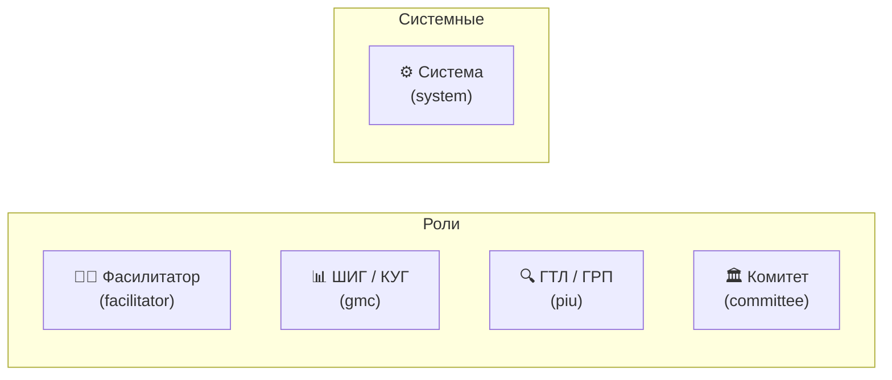
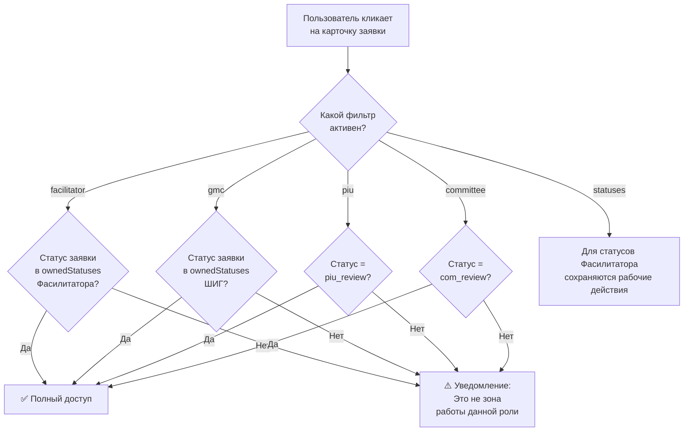
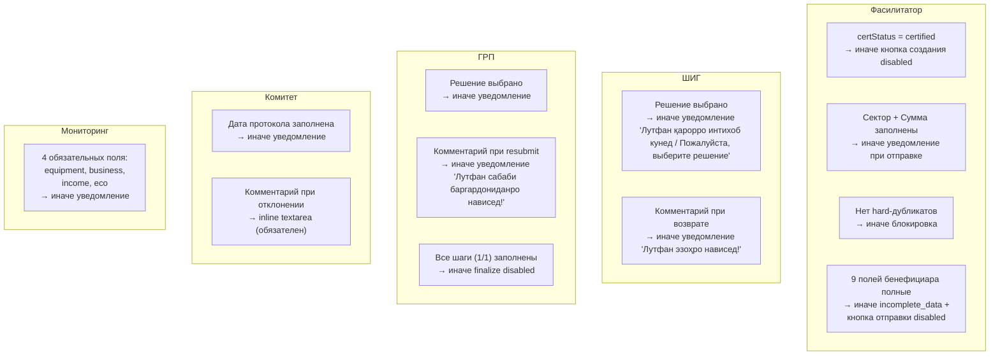
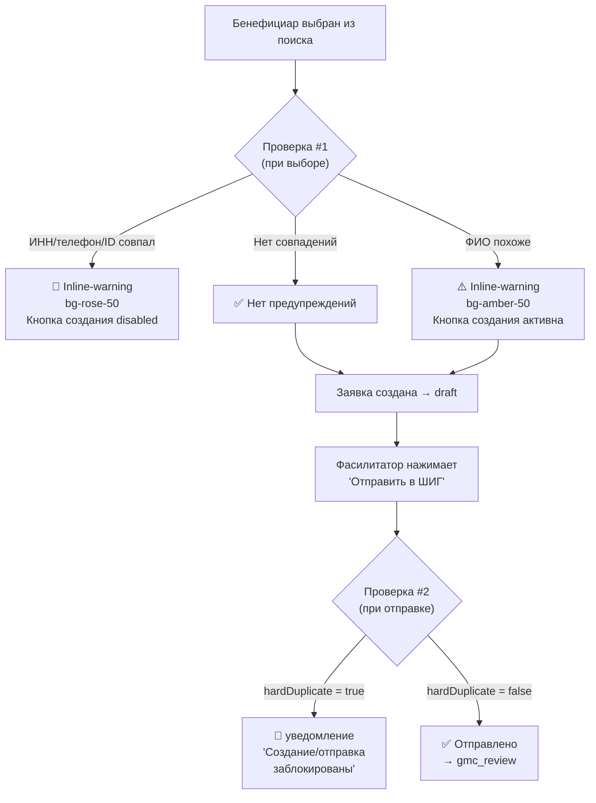

# Управление доступом / Access Control

## Актуализация от 14.03.2026

- Пользовательские сообщения переведены на систему `AppNotify` (toast + confirm modal).
- Прямые `alert(...)` в рабочих сценариях заменены; `alert` оставлен только как fallback внутри helper-оберток.
- Для неполных данных бенефициара в UI показываются локализованные подписи полей (TJ/RU), без технических английских ключей.

## Роли в системе



---

## Матрица доступа по статусам заявки

Кто может **открывать и работать** с заявкой в зависимости от её статуса:

| Статус заявки | Фасилитатор | ШИГ / КУГ | ГТЛ / ГРП | Комитет |
|---|:---:|:---:|:---:|:---:|
| `draft` | ✅ **Редактирование** | 👁 Просмотр | 👁 Просмотр | 👁 Просмотр |
| `incomplete_data` | ✅ **Редактирование** (отправка заблокирована) | 👁 Просмотр | 👁 Просмотр | 👁 Просмотр |
| `fac_revision` | ✅ **Доработка** | 👁 Просмотр | 👁 Просмотр | 👁 Просмотр |
| `gmc_review` | 👁 Просмотр | ✅ **Скоринг** | 👁 Просмотр | 👁 Просмотр |
| `gmc_revision` | 👁 Просмотр | ✅ **Исправление** | 👁 Просмотр | 👁 Просмотр |
| `gmc_preparation` | 👁 Просмотр | ✅ **Подготовка реестра** | 👁 Просмотр | 👁 Просмотр |
| `gmc_ready_for_registry` | 👁 Просмотр | ✅ **Формирование реестра** | 👁 Просмотр | 👁 Просмотр |
| `piu_review` | 👁 Просмотр | 👁 Просмотр | ✅ **Проверка** | 👁 Просмотр |
| `com_review` | 👁 Просмотр | 👁 Просмотр | 👁 Просмотр | ✅ **Утверждение** |
| `approved` | 👁 + 📝 Черновик договора + 📎 Договор + 📊 Мониторинг | 👁 Просмотр | 👁 Просмотр | 👁 Просмотр |
| `rejected` | 👁 История | 👁 История | 👁 История | 👁 История |
| `postponed` | ✅ **Разблокировка/история** (если срок блокировки истек) | 👁 История | 👁 История | 👁 История |

---

## Матрица действий по ролям

### Фасилитатор (facilitator)

| Действие | Функция в коде | Условие |
|----------|---------------|---------|
| Создать заявку | `submitToGmc()` | Бенефициар certified, нет дубля по ИНН/тел. |
| Сохранить черновик | `saveToDraft()` | Заявка в статусе `draft` или `incomplete_data`. Если данные неполные → `status = 'incomplete_data'`, `missingFields = [...]` |
| Отправить в ШИГ / КУГ | `submitToGmc()` | Заполнены сектор + сумма, `isComplete === true`. Если неполные → предупреждение через `AppNotify` + return (кнопка `#btn-submit-facilitator` disabled) |
| Доработать заявку | `openRevFor()` | Статус `fac_revision` |
| Проводить мониторинг | `saveMonitoringVisit()` | Статус `approved`, визит `active` |
| Просмотр истории | `openApprovedFor()` | Любой статус |
| Заполнить/сохранить черновик договора | `saveGrantContractDraftFromModal()` | Только `approved`, только Фасилитатор |
| Предпросмотр/печать/PDF договора | `previewGrantContractDraftFromModal()`, `printGrantContractDraftFromModal()`, `exportGrantContractPdfFromModal()` | Только `approved`, обязательные поля валидны |
| Загрузить подписанный договор | `uploadGrantAgreementFromModal()` | Только `approved`, только Фасилитатор |
| Скачать подписанный договор | `downloadCurrentGrantAgreementFromModal()` | Если договор загружен |

### ШИГ / КУГ (gmc)

| Действие | Функция в коде | Условие |
|----------|---------------|---------|
| Оценить заявку (скоринг) | `loadGmcForm()`, `saveGmcDecision()` | Статус `gmc_review` |
| Рекомендовать в ГТЛ / ГРП | `saveGmcDecision()` (ok) | Балл ≥ 45 |
| Вернуть на доработку | `saveGmcDecision()` (rev) | Балл 30-44 |
| Отклонить | `saveGmcDecision()` (rej) | Балл < 30 или el = "no" |
| Анализ возврата из ГРП/Комитета | `sendGmcBackToPiu()`, `sendGmcToFacilitator()` | Статус `gmc_revision` |
| Добавить в реестр | `markReadyForRegistry()` | Статус `gmc_preparation` |
| Выбрать для реестра | `toggleRegistrySelection()` | Статус `gmc_ready_for_registry` |
| Создать реестр | `openRegistryPreview()` | Выбрана ≥ 1 заявка |
| Отправить реестр в Комитет | (в preview) | Реестр сформирован |

### ГТЛ / ГРП (piu)

| Действие | Функция в коде | Условие |
|----------|---------------|---------|
| Провести проверку | `loadPiuForm()` | Статус `piu_review` |
| Одобрить | `setPiuDecision(id, 'approve')` | — |
| Вернуть на доработку | `setPiuDecision(id, 'resubmit')` | Обязателен комментарий |
| Завершить проверку | `finalizePiu()` | Все шаги заполнены (1/1) |

### Комитет (committee)

| Действие | Функция в коде | Условие |
|----------|---------------|---------|
| Просмотр реестра | `openCommitteeBatch()` | Есть входящие реестры |
| Одобрить заявку | через `<select>` в batch | Статус `com_review` |
| Отклонить заявку | через `<select>` в batch | Обязателен комментарий |
| Утвердить список | `submitCommitteeBatch()` | Заполнены: дата, решения |
| Экспорт протокола | `exportProtocolToExcel()` | Протокол уже утвержден |
| Скачать текущую Word-версию | `downloadCommitteeBusinessPlan()` | Для каждой заявки в реестре |
| Скачать фиксированный PDF | `downloadCommitteePdf()` | Для каждой заявки в реестре |
| Скачать фиксированный фото-комплект | `downloadCommitteePhotos()` | Для каждой заявки в реестре |

### Система и ручные действия

| Действие | Условие |
|----------|---------|
| Отложить заявку (postponed) | revisionCount достиг 3/3 (3-е неодобрение) |
| Пометить заявку «готова к разблокировке (unlock-ready)» | Прошло 3 месяца паузы |
| Снять блокировку вручную | Фасилитатор нажал «Разблокировать» после истечения срока |
| Создать мониторинг (4 визита) | Заявка утверждена Комитетом |
| Активировать следующий визит | Предыдущий визит завершён |
| Уведомление: оборудование продано | equipment = "sold" в мониторинге |

---

## Контроль доступа на уровне UI

### Механизм блокировки (canOpenInCurrentContext)



### Зоны ответственности ролей (ownedStatuses)

```javascript
const roleRules = {
    facilitator: {
        ownedStatuses: ['draft', 'fac_revision', 'postponed', 'incomplete_data']
    },
    gmc: {
        ownedStatuses: ['gmc_review', 'gmc_revision', 'gmc_preparation', 'gmc_ready_for_registry']
    },
    piu: {
        ownedStatuses: ['piu_review']
    },
    committee: {
        ownedStatuses: ['com_review']
    }
};
```

### Поведение вне зоны ответственности

Когда пользователь находится в фильтре одной роли, но видит заявку другой роли:

| Элемент | Поведение |
|---------|-----------|
| Кнопка действия на карточке | Для чужих статусов: «Танҳо дидан / Только просмотр». Для статусов Фасилитатора: рабочее действие сохраняется |
| Чекбокс (для реестра) | Скрыт |
| Клик на карточку | Для `approved/rejected`: открывает read-only. Для остальных чужих статусов: уведомление «Ин марҳила кори [Роль] нест» |
| Табы в модальном окне | Неактивные табы полупрозрачны, pointer-events: none |

---
## Режимы «Только чтение» (Read-Only)

Формы ШИГ и ГРП автоматически переключаются в read-only, когда заявка находится вне зоны активной работы данной роли.

### ШИГ — read-only режим (`makeReadonly()`)

При следующих статусах **все** radio-кнопки и inputs формы ШИГ получают `disabled = true`, кнопки решений и сохранения скрываются:

| Статус | Форма ШИГ | Что блокируется |
|--------|-----------|----------------|
| `gmc_review` | ✏️ Редактируемая | — |
| `gmc_revision` | ✏️ Редактируемая | — |
| `gmc_preparation` | 🔒 Read-only | Все radio, select, comment, кнопки решений |
| `gmc_ready_for_registry` | 🔒 Read-only | Все radio, select, comment, кнопки решений |
| `piu_review` | 🔒 Read-only | Все radio, select, comment, кнопки решений |
| `com_review` | 🔒 Read-only | Все radio, select, comment, кнопки решений |
| `approved` | 🔒 Read-only | Все radio, select, comment, кнопки решений |
| `rejected` | 🔒 Read-only | Все radio, select, comment, кнопки решений |

### ГРП — read-only режим (`isReadonly`)

Форма ГРП блокируется аналогично:

| Статус | Форма ГРП | Что блокируется |
|--------|-----------|----------------|
| `piu_review` | ✏️ Редактируемая | — |
| `gmc_preparation` | 🔒 Read-only | Кнопки решений disabled, комментарий disabled, «Завершить» скрыта |
| `gmc_ready_for_registry` | 🔒 Read-only | То же |
| `com_review` | 🔒 Read-only | То же |
| `approved` | 🔒 Read-only | То же |

### Комитет — read-only при просмотре утверждённого протокола

| Элемент | Поведение |
|---------|----------|
| Дата протокола | `disabled = true` |
| Dropdown решений | `disabled = true` |
| Кнопка «Утвердить» | Скрыта |
| Кнопка «Экспорт» | Доступна |

---

## Валидация и обязательные поля

### Общая схема валидации



### Матрица обязательных полей по ролям

| Роль | Действие | Обязательные поля | Сообщение при нарушении |
|------|----------|-------------------|------------------------|
| Фасилитатор | Создание заявки | certStatus = "certified" | Кнопка «Создать» неактивна (pointer-events: none) |
| Фасилитатор | Отправка в ШИГ | Сектор, Сумма, данные полные | `'Баҳш ва маблағро пур кунед!'` / `'Маълумоти бенефициар нопурра аст!'` |
| Фасилитатор | Отправка в ШИГ | Нет hard-дубликатов | `'Создание/отправка заблокированы: найден дубль по ИНН или телефону.'` |
| Фасилитатор | Загрузка подписанного договора | Статус `approved`, роль Фасилитатор, файл PDF/JPG/JPEG/PNG до 10MB | `'Это действие доступно только Фасилитатору.'` / `'Допустимы только PDF/JPG/PNG до 10MB.'` |
| ШИГ | Сохранить решение | Решение выбрано (ok/rev/rej) | `'Лутфан қарорро интихоб кунед / Пожалуйста, выберите решение'` |
| ШИГ | Возврат Фасилитатору | Комментарий | `'Лутфан эзоҳи бозгардониданро нависед!'` |
| ГРП | Сохранить решение | Решение выбрано | Уведомление: «Выберите решение» |
| ГРП | Возврат (resubmit) | Комментарий | `'Лутфан сабаби баргардониданро нависед!'` |
| ГРП | Завершить проверку | Все шаги оценены (1/1) | Кнопка «Завершить» disabled |
| Комитет | Утвердить список | Дата протокола | Уведомление: «Выберите дату» |
| Комитет | Отклонить заявку | Комментарий (причина) | `window.prompt` — пустой = отмена |
| Мониторинг | Сохранить визит | equipment, business, income, eco | `'Лутфан ҳамаи майдонҳои ҳатмиро пур кунед!'` |

---

## Предупреждения и уведомления (AppNotify)

> Все сообщения в системе **двуязычные**: тексты содержат и таджикский, и русский варианты.

### Полный каталог сообщений системы

#### Блокировки создания (Фасилитатор)

| Ситуация | Тип | Текст сообщения |
|----------|-----|----------------|
| Дубликат ИНН/телефона | 🛑 Hard block (inline) | Красный блок `bg-rose-50`: «Манъ / Блокировка: Такрор ёфт шуд / Найден дубль: ИНН. Дар дархостҳо / Совпадение в заявках: #10001» |
| Похожее ФИО найдено | ⚠️ Soft warning (inline) | Жёлтый блок `bg-amber-50`: «Такрор ёфт шуд / Найден дубль: ФИО. Дар дархостҳо / Совпадение в заявках: #10001» |
| Нажатие «Создать» при hard block | 🛑 Toast (error) | `'Эҷод манъ аст / Создание заблокировано: ...'` |
| Нажатие «Отправить в ШИГ» при hard block | 🛑 Toast (error) | `'Эҷод ва ирсол манъ аст / Создание и отправка заблокированы: ...'` |
| Сектор или сумма не заполнены | ⚠️ Toast (warning) | `'Бахш ва маблағро пур кунед! / Заполните сектор и сумму!'` |
| Данные бенефициара неполные (при отправке) | 🛑 Toast (error) | `'Маълумоти бенефициар нопурра аст! / Данные бенефициара неполные! Ирсол имконнопазир аст. / Отправка невозможна.'` |
| Данные бенефициара неполные (при выборе) | ⚠️ Inline (оранжевый) | `'⚠ Маълумоти бенефициар нопурра аст! / Данные бенефициара неполные: Тамос / Контакты, РМА (ИНН), ...'` |
| Данные бенефициара неполные + дубликат | ⚠️ Inline (оранжевый) | `'⚠ ... Инчунин ёфт шуд такрор / Также найден дубль: поля дар дархостҳо / в заявках: #IDs'` |

#### Решения ШИГ (GMC)

| Ситуация | Тип | Текст сообщения |
|----------|-----|----------------|
| Не выбрано решение | ⚠️ Toast (warning) | `'Лутфан қарорро интихоб кунед / Пожалуйста, выберите решение'` |
| Рекомендован в ГТЛ / ГРП | ✅ Toast (success/info) | `'Тасдиқ шуд ва ба ГТЛ равон шуд. / Утверждено и направлено в ГРП.'` |
| Возвращён на доработку | 🔄 Toast (info) | `'Ба такмил баргардонида шуд. / Возвращено на доработку.'` |
| Отклонён | ❌ Toast (warning) | `'Дархост рад карда шуд. / Заявка отклонена.'` |
| Возврат Фасилитатору без комментария | ⚠️ Toast (warning) | `'Сабаби бозгардониданро нишон диҳед! / Укажите причину возврата!'` |
| Лимит доработок 3/3 → postponed | ⏸️ Toast (warning) | `'Лимити такмил (3/3) ба итмом расид. / Лимит доработок исчерпан. Дархост ба таъхир гузошта шуд. / Заявка отложена.'` |
| Добавление в реестр (0 выбрано) | ⚠️ Toast (warning) | `'Лутфан ҳадди аққал як дархостро интихоб кунед! / Пожалуйста, выберите хотя бы одну заявку!'` |

#### Решения ГТЛ / ГРП

| Ситуация | Тип | Текст сообщения |
|----------|-----|----------------|
| Возврат без комментария | ⚠️ Toast (warning) | `'Лутфан сабаби баргардониданро нависед! / Укажите причину возврата!'` |

#### Комитет (Committee)

| Ситуация | Тип | Текст сообщения |
|----------|-----|----------------|
| Не выбран реестр | ⚠️ Toast (warning) | `'Аввал рӯйхати лозимро интихоб кунед / Сначала выберите нужный список'` |
| Дата протокола не заполнена | ⚠️ Toast (warning) | `'Санаро интихоб кунед / Выберите дату'` |
| Отклонение заявки | 📝 Prompt | `window.prompt('Сабаби рад кардан / Причина отклонения:')` |
| Список утверждён | ✅ Toast (success) | `'Рӯйхат бомуваффақият тасдиқ шуд!\nСписок успешно утвержден!\n\nТасдиқшуда / Одобрено: X\nРадшуда / Отклонено: Y'` |
| Список пуст | ⚠️ Toast (warning) | `'Рӯйхат холӣ аст / Список пуст'` |

#### Мониторинг

| Ситуация | Тип | Текст сообщения |
|----------|-----|----------------|
| Не все обязательные поля заполнены | ⚠️ Toast (warning) | `'Лутфан ҳамаи майдонҳои ҳатмиро пур кунед! / Пожалуйста, заполните все обязательные поля!'` |
| Оборудование = "Продано" | 🔴 Inline + Toast | Красный блок: `'Огоҳӣ ба Админ фиристода мешавад! / Уведомление Админу!'` + toast: `'Огоҳинома ба Администратор фиристода шуд! / Уведомление отправлено Администратору!'` |

---

## Детали проверки дубликатов

### Два момента проверки

Система проверяет дубликаты в **двух точках** — при создании заявки и при отправке в ШИГ:



### Критерии дубликатов

| Критерий | Тип | Поведение | Визуальное оформление |
|----------|-----|-----------|----------------------|
| Совпадение `beneficiaryId` | 🛑 Hard | Блокировка создания | `bg-rose-50 border-rose-200 text-rose-800` |
| Совпадение `inn` | 🛑 Hard | Блокировка создания + отправки | `bg-rose-50 border-rose-200 text-rose-800` |
| Совпадение `contacts` (телефон) | 🛑 Hard | Блокировка создания + отправки | `bg-rose-50 border-rose-200 text-rose-800` |
| Совпадение `name` (похожее ФИО) | ⚠️ Soft | Предупреждение, не блокирует | `bg-amber-50 border-amber-200 text-amber-800` |

### Проверка дубликатов в реальном времени

Функция `updateQueryDuplicateWarning()` срабатывает **при каждом вводе** в поле поиска (ещё до выбора бенефициара из списка) и показывает inline-предупреждение, если текст запроса совпадает с существующей заявкой.

---
## Диаграмма взаимодействия ролей (UML Use Case)

```mermaid
graph TB
    subgraph "Фасилитатор"
        UC1[Поиск бенефициара]
        UC2[Создание заявки]
        UC3[Сохранение черновика]
        UC4[Отправка в ШИГ]
        UC5[Доработка заявки]
        UC6[Мониторинг гранта]
    end

    subgraph "ШИГ / КУГ"
        UC7[Скоринг заявки]
        UC8[Рекомендация в ГРП]
        UC9[Возврат на доработку]
        UC10[Отклонение заявки]
        UC11[Анализ возврата ГРП]
        UC12[Подготовка реестра]
        UC13[Формирование реестра]
    end

    subgraph "ГТЛ / ГРП"
        UC14[Социально-экологическая проверка]
        UC15[Одобрение проверки]
        UC16[Возврат в ШИГ]
    end

    subgraph "Комитет"
        UC17[Просмотр реестра]
        UC18[Утверждение списка]
        UC19[Экспорт протокола]
        UC20[Скачивание Word версии]
        UC21[Скачивание PDF]
        UC22[Скачивание фото-комплекта]
    end

    UC4 -->|gmc_review| UC7
    UC8 -->|piu_review| UC14
    UC9 -->|fac_revision| UC5
    UC15 -->|gmc_preparation| UC12
    UC16 -->|gmc_revision| UC11
    UC13 -->|com_review| UC17
    UC18 -->|approved| UC6
```


