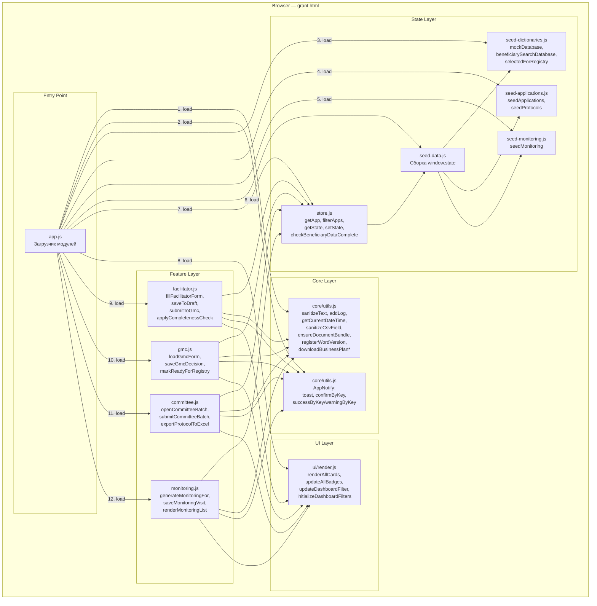
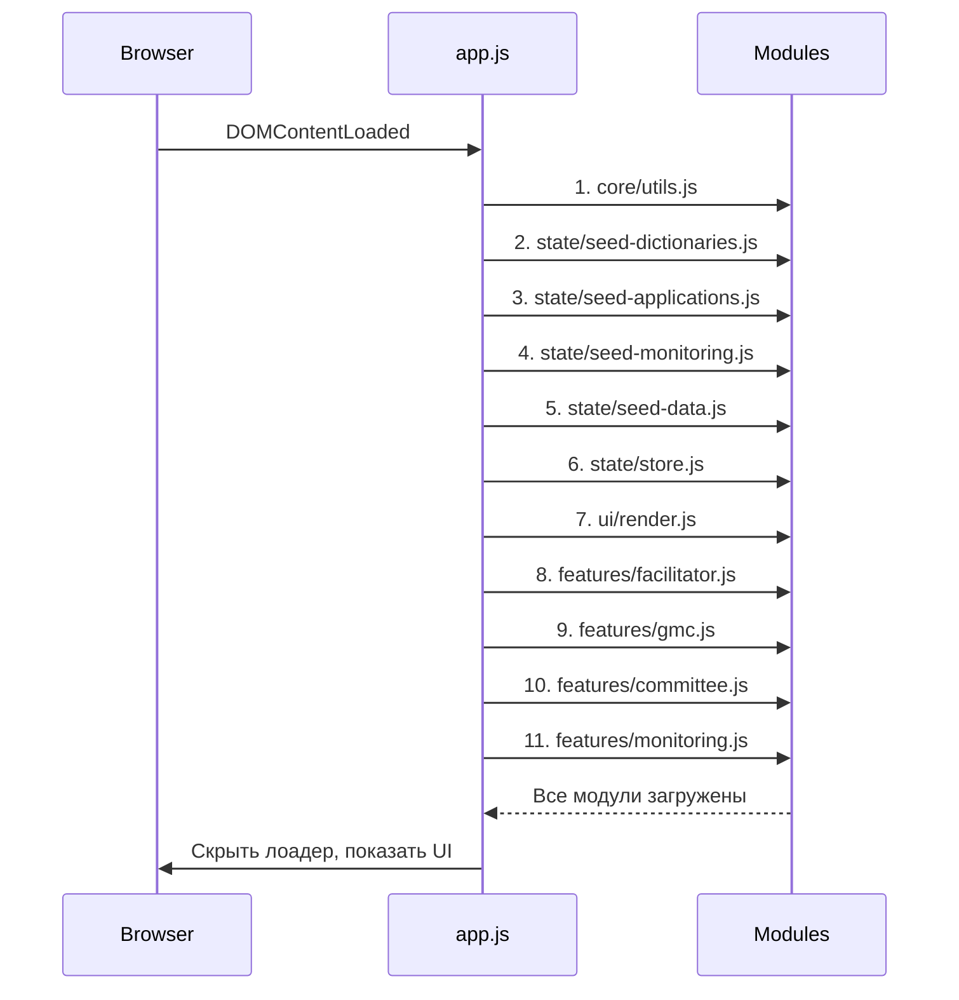
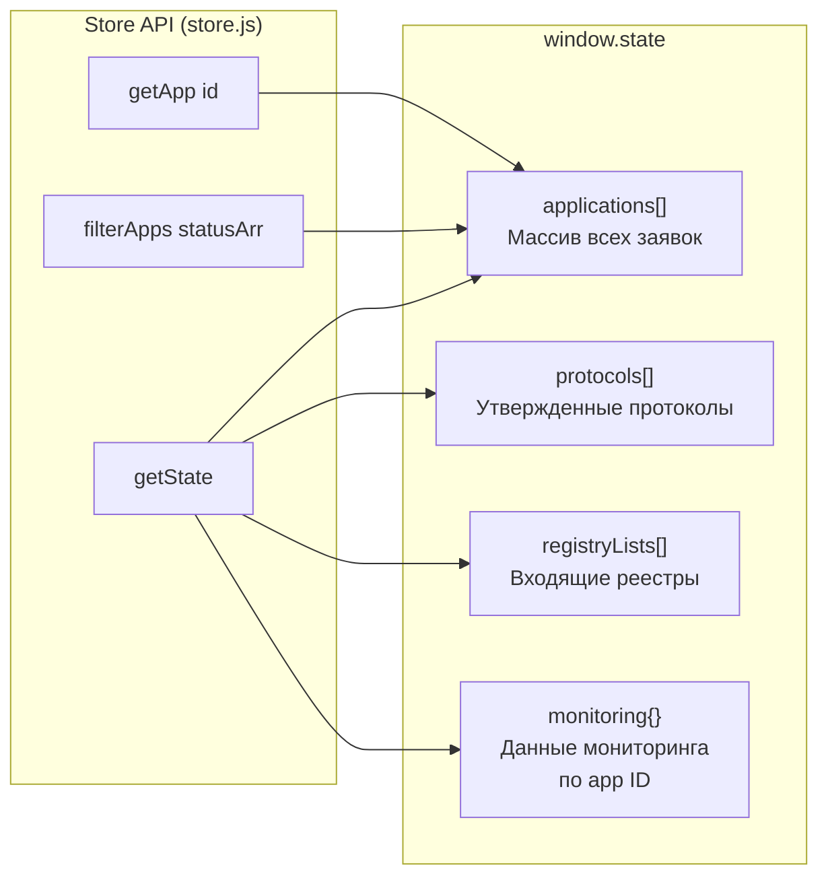
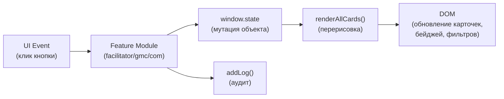
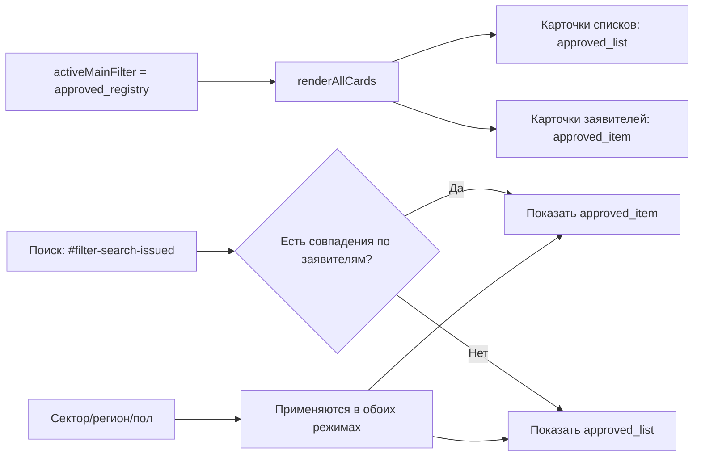
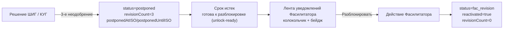
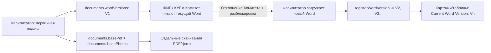
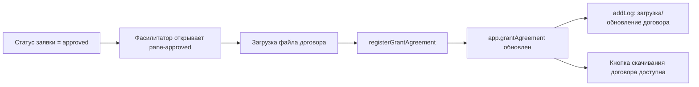

# Архитектура системы / System Architecture

## Актуализация от 17.03.2026

- **Унифицированная система уведомлений**: все сообщения (toast + confirm) переработаны в единый дизайн: центр экрана, размытый фон (`backdrop-filter: blur`), круглая иконка-индикатор (✓ / ! / i / ?), анимация `scale(0.9 → 1)`.
- **Поле ФИО оператора ШИГ/КУГ**: добавлено в форму GMC форма, обязательно для всех действий оператора (блокирует кнопки решений до заполнения), используется в аудит-логе вместо обобщённого `'ШИГ / КУГ'`.
- **Меню фильтров**: выровнено по `flex: 1 1 0` (равные ширины для всех 7 кнопок), удалены KPI-блоки (135/30/1) из правой части шапки, все кнопки одной высоты (74px), бейджи имеют меньше padding и шрифт (9px, 0 vertical padding).
- **Система уведомлений полностью заменена**: старые toast в нижнем-правом углу и базовые confirm-диалоги удалены; все сообщения через `AppNotify.toast()` и `AppNotify.confirm()`.
- Фича-модули используют локальные `notifyMessage`-обертки и вызывают `AppNotify` как основной канал, сохраняя `alert` только как fallback.
- В блоке черновика договора (pane approved) в UI добавлена нижняя кнопка закрытия `Бекор кардан / Отмена`.

## Обзор

Система представляет собой **одностраничное веб-приложение** (SPA), работающее полностью на клиенте без серверной части. Все данные хранятся в памяти браузера (`window.state`).

### Ключевые принципы:
- **IIFE-модули** с guard-паттерном для предотвращения повторной инициализации
- **Глобальная область** через `window.*` для межмодульной коммуникации
- **Двуязычный интерфейс**: все надписи на таджикском (крупнее) + русском (мельче) через CSS-классы `.ru`, `.ru-block`, `.ru.font-normal`
- **XSS-защита**: санитизация через `sanitizeText()` для всех пользовательских вводов

---

## Диаграмма компонентов (UML Component Diagram)



---

## Порядок загрузки модулей

Модули загружаются **строго последовательно** через `app.js`:



Каждый модуль обернут в **IIFE** (`(function init...() { ... })()`) с guard-проверкой повторной инициализации.

---

## Паттерн модульности

```
┌──────────────────────────────────────────┐
│  (function initModuleName() {            │
│      if (window.ModuleName) return;  ◄── guard от повторной загрузки
│                                          │
│      function privateFunc() { ... }      │
│                                          │
│      // Public API через namespace       │
│      window.AppFeatures.moduleName = {   │
│          ready: true,                    │
│          publicFunc: privateFunc         │
│      };                                  │
│                                          │
│      // Legacy compatibility             │
│      window.publicFunc = privateFunc; ◄── прямой доступ через window
│  })();                                   │
└──────────────────────────────────────────┘
```

---

## Управление состоянием (State Management)



### Поток данных (Data Flow)



### Поток фильтрации в разделе одобренных



Ключевая идея:
- Поиск по ID/ФИО заявителя переключает вид на карточки отдельных заявителей.
- Поиск по номеру списка/протокола оставляет вид карточек списков.

### Поток блокировки и ручной разблокировки



Ключевые принципы:
- Автоматической реактивации нет: даже после истечения срока заявка остается в `postponed`.
- Разблокировка выполняется только вручную Фасилитатором.
- UI показывает постоянную метку, что заявка была возвращена после периода блокировки.

### Поток документов бизнес-плана (Word versioning)



Ключевые принципы:
- Версионируется только Word-документ бизнес-плана.
- PDF и фото-комплект фиксируются один раз как базовые вложения.
- Скачивание разделено на 3 действия: текущая Word-версия, фиксированный PDF, фиксированный фото-комплект.

### Поток подписанного договора (после approved)



Ключевые принципы:
- Загрузка доступна только Фасилитатору и только в статусе `approved`.
- Для остальных ролей блок работает в режиме просмотра/скачивания.
- Метаданные договора (кто/когда/какой файл) отображаются в UI и сохраняются в состоянии заявки.

### Поток формирования черновика договора (после approved)

```mermaid
flowchart LR
    A[Статус заявки = approved] --> B[Фасилитатор раскрывает full-width блок договора]
    B --> C[renderGrantContractDraftPanel]
    C --> D[Автополя из app + beneficiary db]
    D --> E[Ручные поля по структуре договора]
    E --> F[formatContractNumberValue -> Ш-******-ДДММГГ]
    F --> G[saveGrantContractDraftFromModal]
    G --> H[app.grantContractDraft.fields]
    H --> I[preview/print/export PDF]
```



Ключевые принципы:
- Блок формы раскрывается по кнопке и рендерится отдельным full-width разделом.
- Порядок полей и групп фиксирован под шаблон договора.
- Номер договора нормализуется в формат `Ш-******-ДДММГГ`.
- Сумма договора всегда берется из approved заявки.

---

## Внешние зависимости

| Библиотека | Версия | Назначение | Загрузка |
|------------|--------|------------|----------|
| Tailwind CSS | latest | Утилитарные CSS-классы | CDN `cdn.tailwindcss.com` |
| Lucide Icons | latest | SVG-иконки | CDN `unpkg.com/lucide@latest` |
| Inter Font | — | Шрифт интерфейса | Google Fonts CDN |

> **Важно:** Все зависимости загружаются с CDN. Для офлайн-работы необходимо скачать их локально.

---

## Безопасность

### Реализованные меры

| Мера | Модуль | Описание |
|------|--------|----------|
| XSS-защита | `utils.js` → `sanitizeText()` | Экранирование `& < > " '` при сохранении пользовательского ввода |
| CSV-инъекция | `utils.js` → `sanitizeCsvField()` | Блокировка формул `= + - @` при экспорте |
| Дедупликация | `facilitator.js` | Блокировка создания заявки при совпадении ИНН/телефона |
| Guard-проверки | Все модули | Предотвращение повторной инициализации |

### Ограничения прототипа

- Нет аутентификации и авторизации на сервере
- Данные хранятся только в памяти (теряются при перезагрузке)
- Глобальный scope (`window.*`) — подходит для прототипа, не для продакшена
