# Бизнес-процессы системы / Business Processes

## Актуализация от 17.03.2026

- **Единая система уведомлений**: все сообщения об ошибках, предупреждения, подтверждения действий отображаются в одном стиле — по центру экрана с blur-оверлеем и иконкой-индикатором.
- **ФИО оператора ШИГ/КУГ**: обязательное поле для всех действий в форме GMC (сохранение оценки, любого решения), валидация блокирует кнопки до ввода, используется вместо обобщённого названия роли в логах.
- В предупреждении о неполных данных бенефициара список отсутствующих полей отображается локализованными лейблами (TJ/RU).
- В форме договора добавлена нижняя кнопка `Бекор кардан / Отмена` рядом с действиями сохранения и печати.

> **Двуязычность**: Все тексты интерфейса (кнопки, бейджи, оповещения, заголовки, поля форм, критерии оценки, документы, CSV-экспорт) являются двуязычными — таджикский текст отображается крупнее, русский — мельче. Ни одна надпись не существует на одном языке.

## Актуализация от 13.03.2026

- При 3-м неодобрении заявка переводится в `postponed` и блокируется на 3 месяца.
- Автоматической реактивации после 3 месяцев нет.
- После истечения срока заявка получает признак `unlock-ready` (готова к разблокировке), но остается в `postponed` до ручного действия Фасилитатора.
- Разблокировка выполняется только вручную кнопкой `Разблокировать` (из карточки/таблицы или из ленты уведомлений).
- После ручной разблокировки заявка переходит в `fac_revision`, `reactivated = true`, `revisionCount = 0`.
- Документный пакет бизнес-плана: версионируется только Word-файл (`V1`, `V2`, ...).
- PDF и фото-комплект являются фиксированными вложениями базовой версии.
- При первичной отправке обязательны: Word + PDF + ровно 4 фото.
- В карточках/таблицах отображается `Current Word Version: Vn`.
- В рабочих экранах доступны отдельные действия скачивания: Word, PDF, фото.

## Обзор участников

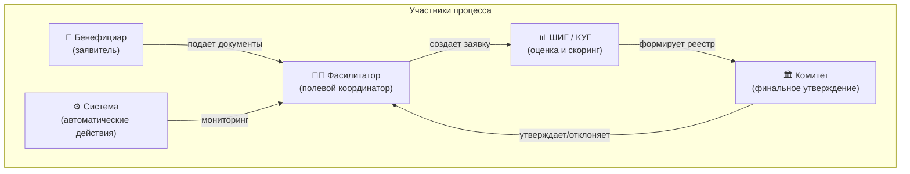

---

## БП-1: Создание новой заявки

### Описание
Фасилитатор регистрирует бенефициара и создает грантовую заявку.

### Предусловия
- Бенефициар имеет статус `certified` в базе
- Нет блокирующих дублей по ИНН или телефону

### Последовательность действий

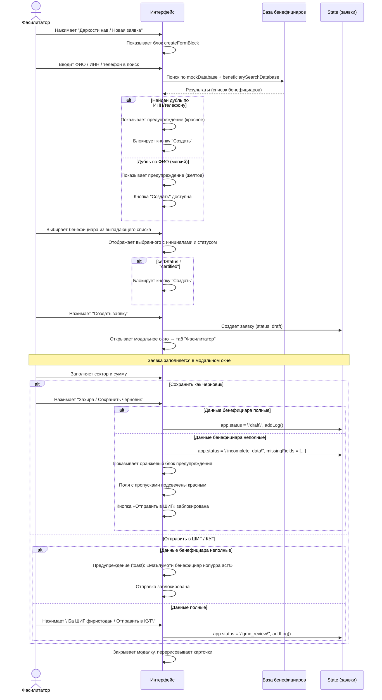

### Где отображается
| Элемент | ID в DOM | Описание |
|---------|----------|----------|
| Кнопка "Новая заявка" | `toggleFormBtn` | Шапка страницы, правый угол |
| Блок создания | `createFormBlock` | Под шапкой, скрыт по умолчанию |
| Поиск бенефициара | `beneficiarySearch` | Текстовое поле в блоке создания |
| Выпадающий список | `searchDropdown` | Под полем поиска |
| Предупреждение о дубле | `beneficiary-duplicate-warning` | Под полем поиска |
| Кнопка создания | `submitApplicationBtn` | В блоке создания |

---

## БП-2: Оценка заявки в ШИГ / КУГ (GMC)

### Описание
Специалист ШИГ / КУГ проводит скоринг заявки по 15 критериям и 3 критериям соответствия.

### Диаграмма процесса

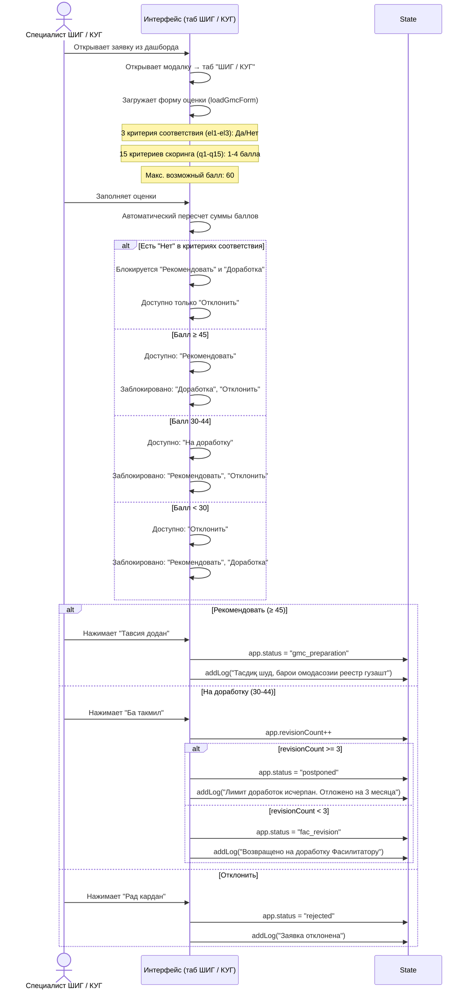

### Правила скоринга

```
┌───────────────────────────────────────────────────┐
│                  СКОРИНГ ШИГ                      │
├───────────────┬───────────────────────────────────┤
│  ≥ 45 баллов  │  → Рекомендовать к подготовке реестра │
│  30-44 балла  │  → На доработку Фасилитатору      │
│  < 30 баллов  │  → Отклонить                      │
│  "Нет" в el*  │  → Только отклонить               │
├───────────────┴───────────────────────────────────┤
│  Лимит доработок: 3 попытки                       │
│  При исчерпании → статус "postponed" (3 мес.)     │
└───────────────────────────────────────────────────┘
```

---

## БП-3: Подготовка реестра в ШИГ / КУГ

### Описание
После положительного решения ШИГ / КУГ заявка переходит на подготовку реестра.

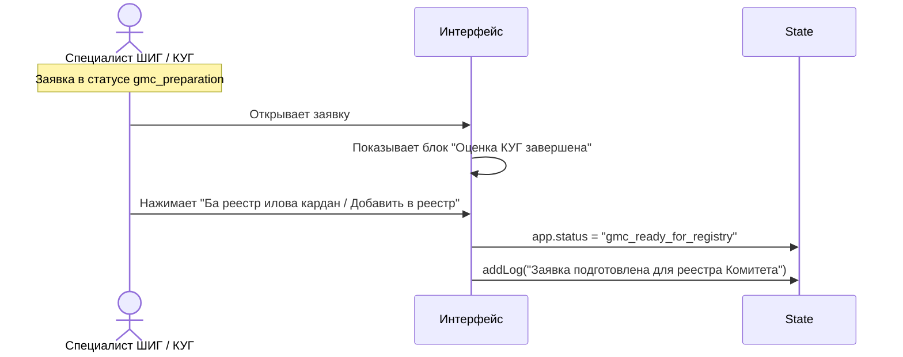

---

## БП-4: Подготовка реестра для Комитета

### Описание
После оценки ШИГ / КУГ заявки готовятся в реестр для отправки в Комитет.

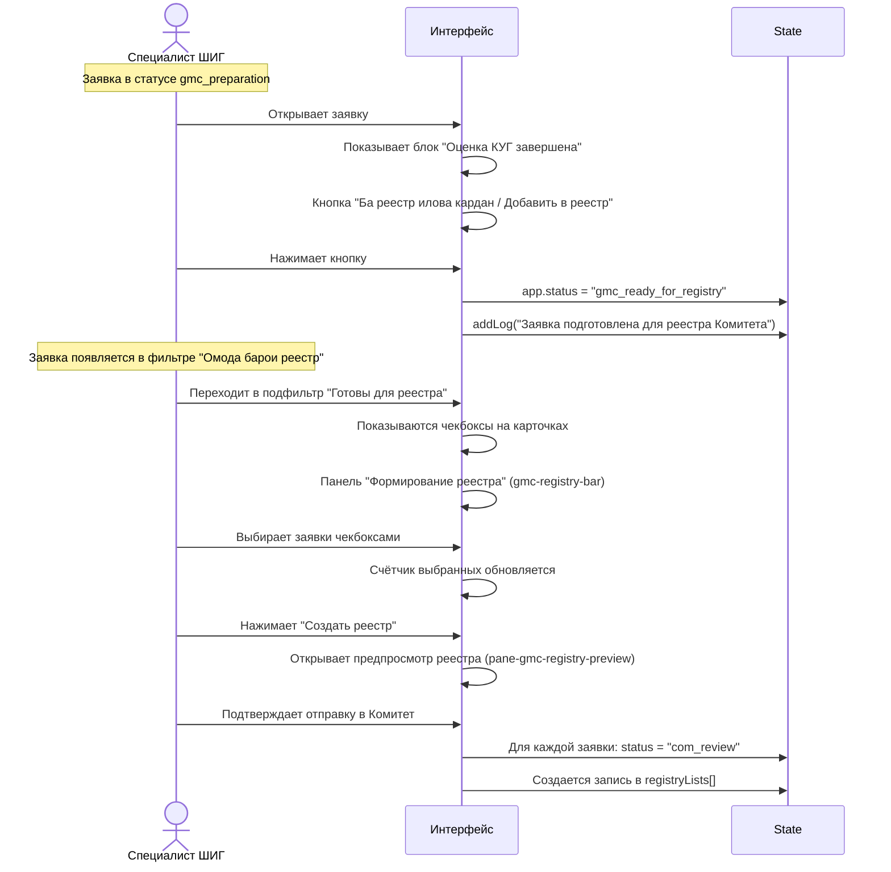

### Схема формирования реестра

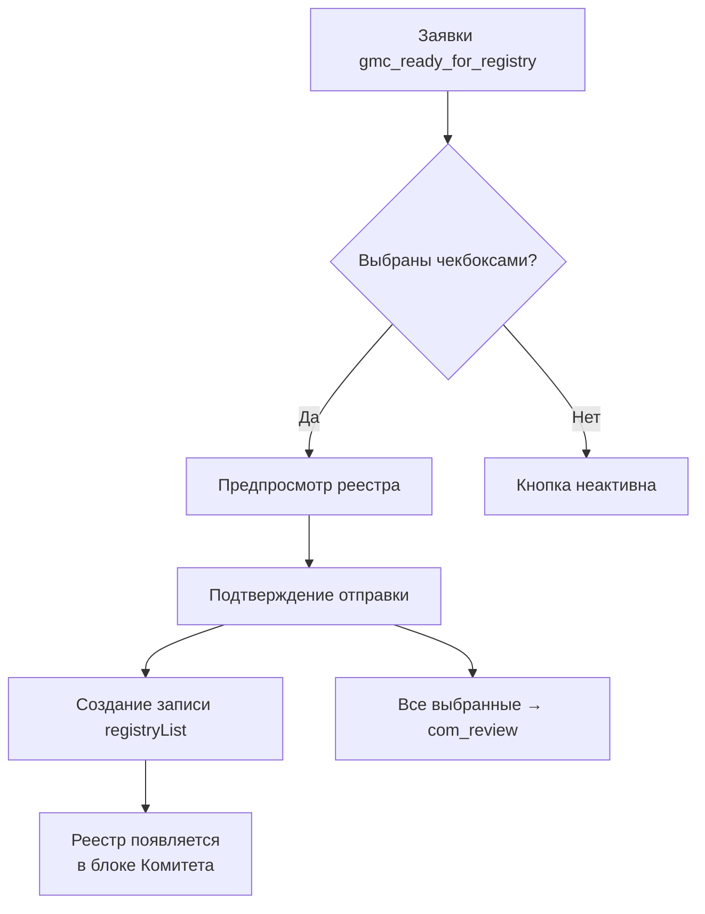

---

## БП-5: Утверждение Комитетом

### Описание
Комитет рассматривает реестр заявок и принимает решение по каждой.

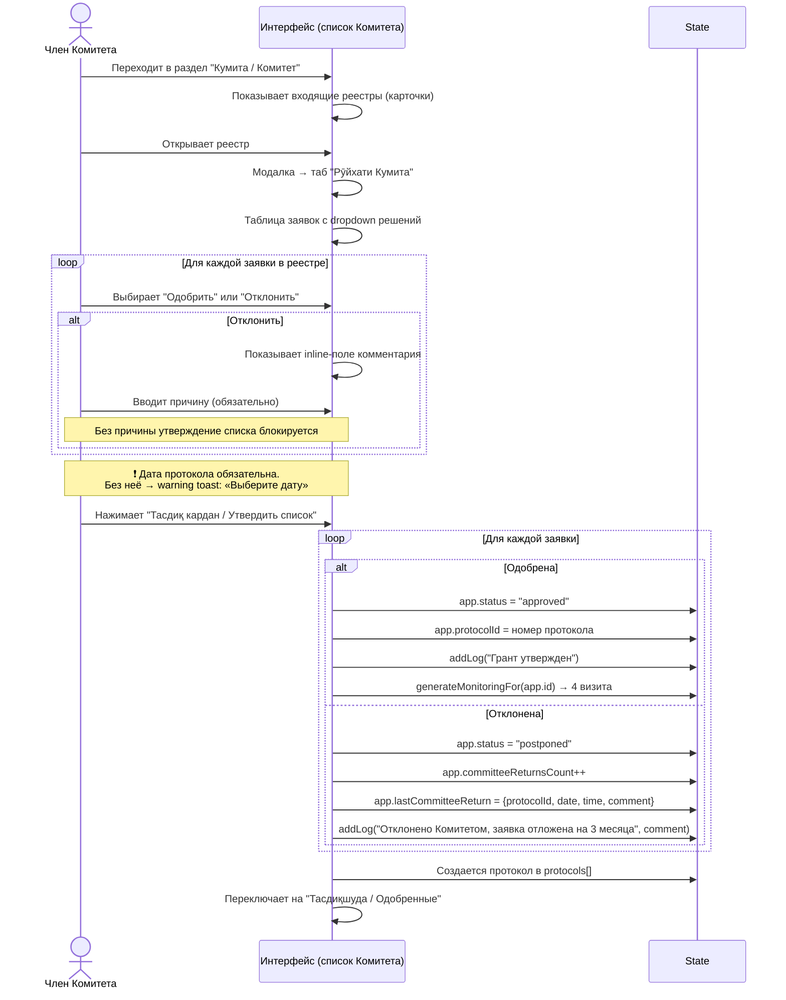

### Структура утверждения

```
┌─────────────────────────────────────────────────┐
│            ЗАСЕДАНИЕ КОМИТЕТА                    │
│                                                 │
│  Входящий реестр: РЕЕСТР-GMS-1001               │
│  Номер протокола: ПР-XXXX (авто)               │
│  Дата: выбирается                               │
│                                                 │
│  ┌───┬──────────────┬─────────┬──────────┐      │
│  │ # │ Заявитель    │ Сумма   │ Решение  │      │
│  ├───┼──────────────┼─────────┼──────────┤      │
│  │ 1 │ Тоиров Б.    │ 10 500  │ ✅ Одобр.│      │
│  │ 2 │ Каримов Р.   │ 15 000  │ ❌ Откл. │      │
│  └───┴──────────────┴─────────┴──────────┘      │
│                                                 │
│  [📥 Word] [📄 PDF] [🖼 Фото] [Тасдиқ кардан / Утвердить] │
└─────────────────────────────────────────────────┘
```

---

## БП-6A: Формирование черновика договора в системе

### Описание
После перехода заявки в `approved` Фасилитатор заполняет демо-форму договора в системе, сохраняет черновик и формирует документ для печати/PDF.

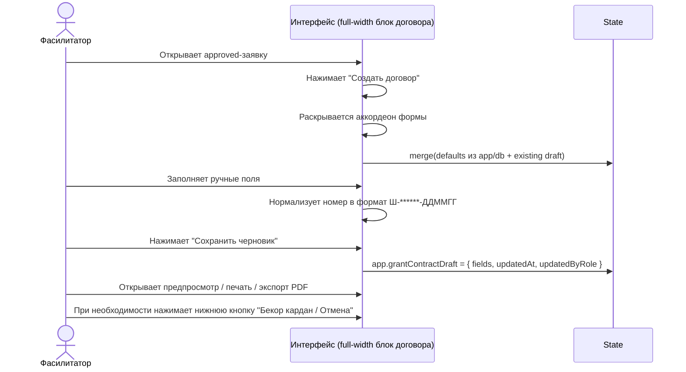

Ключевые правила:
- Раздел доступен только Фасилитатору и только в `approved`.
- Порядок полей в форме соответствует структуре договора.
- Сумма гранта подтягивается автоматически из заявки.
- Для предпросмотра/печати/PDF применяется строгая проверка обязательных полей.

## БП-6: Подписанный договор после одобрения

### Описание
После перехода заявки в `approved` Фасилитатор прикрепляет подписанный скан договора о гранте.

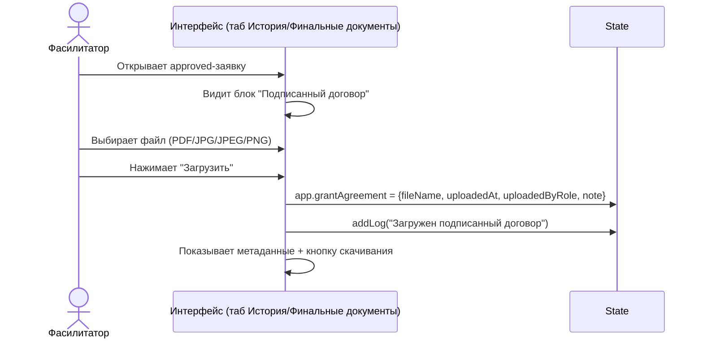

Ключевые правила:
- Загрузка доступна только для `approved`.
- Загрузка доступна только Фасилитатору.
- Каждое обновление договора фиксируется в истории.

---

## БП-7: Мониторинг выданного гранта

### Описание
После утверждения автоматически создается график из 4 мониторинговых визитов.

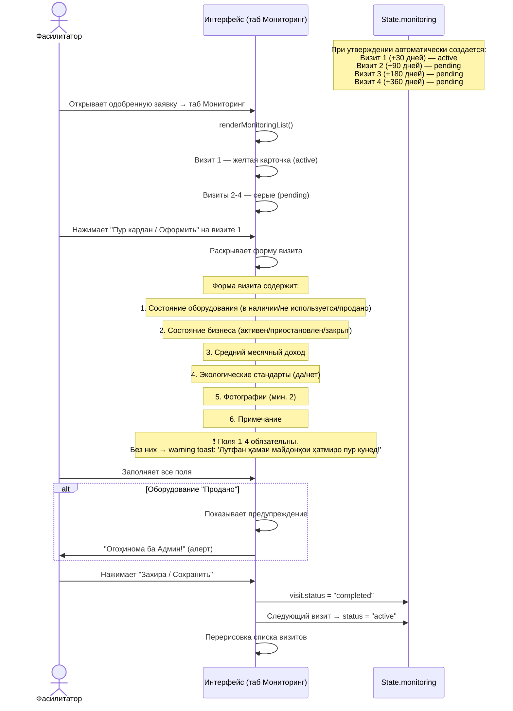

### Жизненный цикл визитов

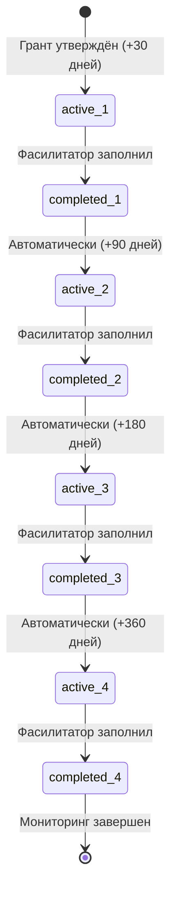

---

## БП-8: Доработка заявки (revision cycle)

### Описание
Заявка возвращается на доработку из ШИГ / КУГ к Фасилитатору. При отклонении Комитетом заявка переводится в `postponed` (3 месяца). Максимум 3 попытки доработки.

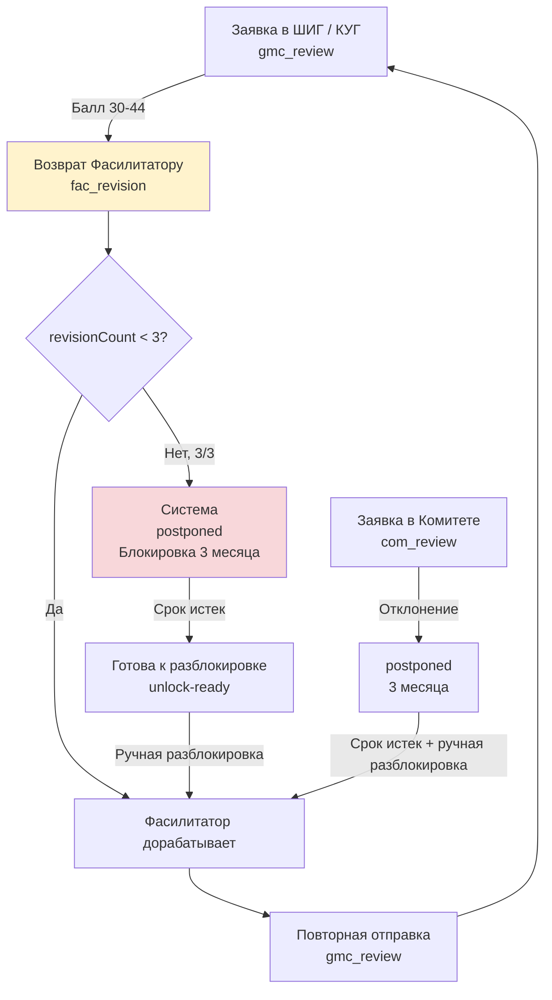

### Обязательные условия при возвратах

| Возврат | Обязательное поле | Уведомление при нарушении |
|---------|-------------------|---------------------|
| ШИГ / КУГ → Фасилитатор (`saveGmcDecision(rev)`) | Комментарий | `'Лутфан эзоҳи бозгардониданро нависед!'` |
| Комитет → `postponed` | Комментарий | фиксируется в возврате Комитета |
| ШИГ / КУГ: лимит 3/3 → postponed | — (автоматически) | `'Лимити такмил (3/3) ба итмом расид. Дархост ба таъхир гузошта шуд.'` |

### Счетчик доработок

```
Попытка 1/3 → fac_revision (можно доработать)
Попытка 2/3 → fac_revision (можно доработать)
Попытка 3/3 → postponed (блокировка на 3 месяца)
              → после истечения срока: unlock-ready (готова к разблокировке)
              → ручная разблокировка Фасилитатором: fac_revision, reactivated = true, revisionCount = 0
```

### Документный цикл при доработках

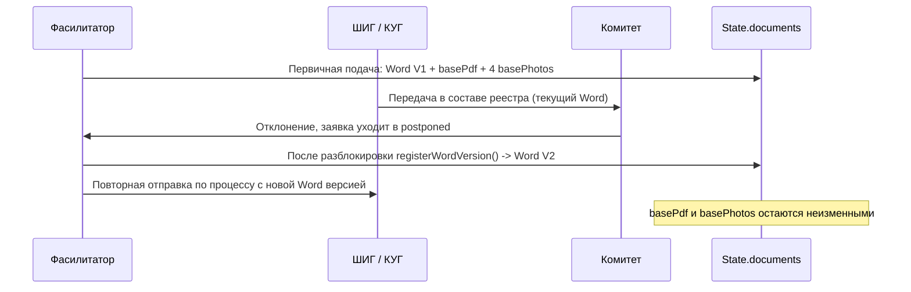

---

## БП-9: Экспорт протокола

### Описание
Утверждённый протокол можно экспортировать в CSV.

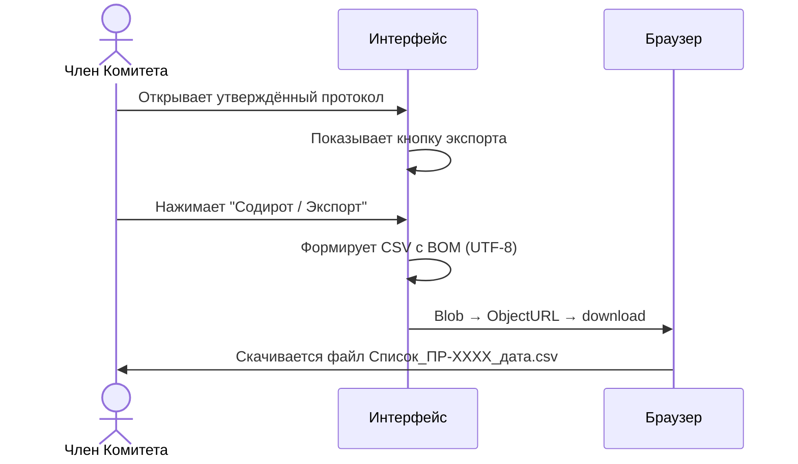

### Формат CSV

```
Давр;Ном;Насаб;Рақами инфиродӣ;Шаҳр;Ноҳия;Номгӯйи тиҷорат;Санаи пешниҳоди НС;Маблағи грант (сомонӣ);Номи нархгузор;Тасдиқ гардида
"СП-9001";"Бахтиёр";"Тоиров";"9876543210";"Хуҷанд";"Бобоҷон Ғафуров";"Савдо";"13.03.2026";"10500";"ШИГ / КУГ";"Ҳа"
```

---

## Сводная диаграмма всех процессов (End-to-End)

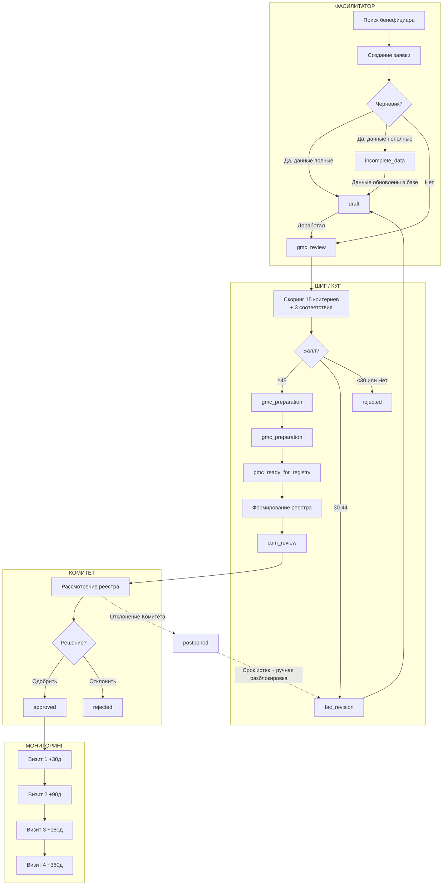
