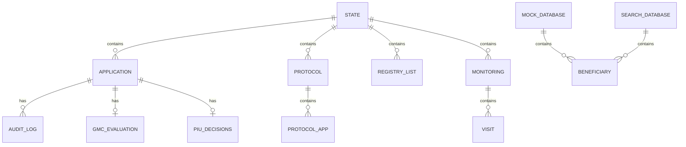
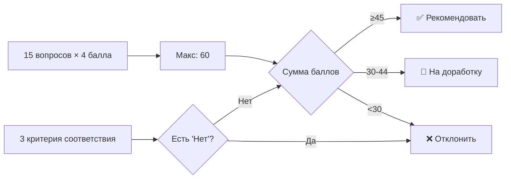
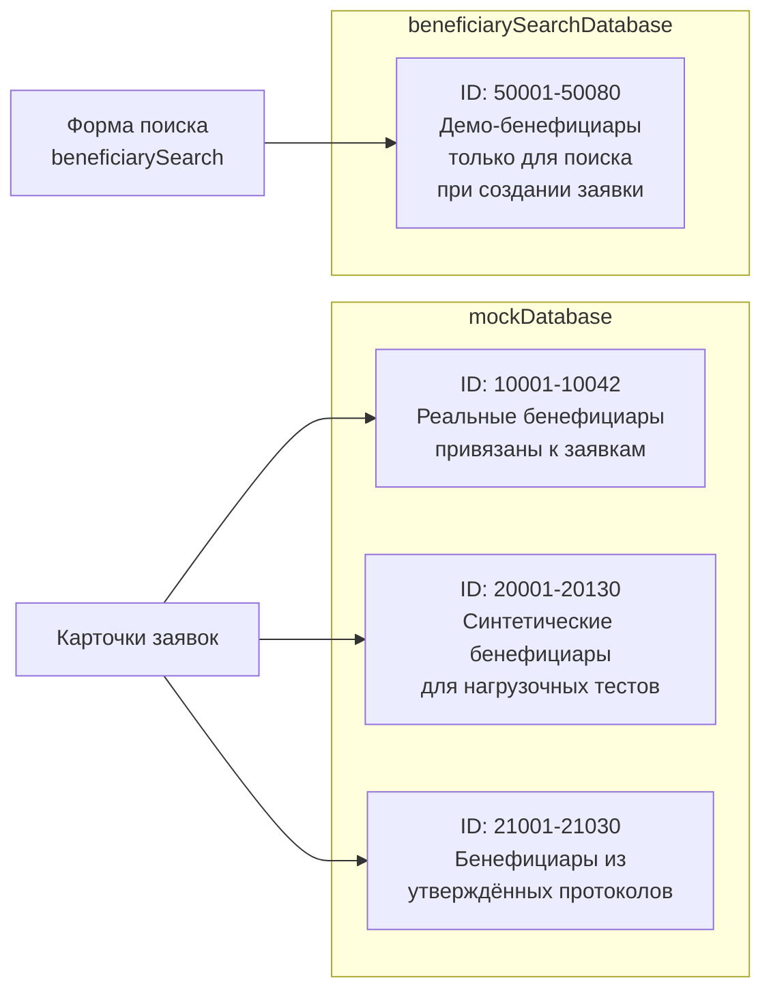

# Модель данных / Data Model

## Обзор

Все данные хранятся в объекте `window.state` и вспомогательных справочниках.



---

## window.state

Основной контейнер всех данных приложения.

```typescript
interface State {
  applications: Application[];    // Все заявки
  protocols: Protocol[];          // Утвержденные протоколы Комитета
  registryLists: RegistryList[];  // Входящие реестры для Комитета
  monitoring: {                   // Данные мониторинга
    [appId: string]: Visit[];     // Ключ — ID заявки
  };
}
```

---

## Application (Заявка)

```typescript
interface Application {
  // === Идентификация ===
  id: string;                    // "10001", "10002", ...
  beneficiaryId?: string;        // ID бенефициара (может = id)

  // === Данные заявителя ===
  name: string;                  // ФИО заявителя (sanitized)
  beneficiaryName?: string;      // ФИО из формы (sanitized)
  inn?: string;                  // ИНН (sanitized)
  contacts?: string;             // Контакты (sanitized)
  beneficiarySnapshot?: {        // Снимок данных заявителя на момент сохранения/отправки
    fullName?: string;
    birthDate?: string;
    gender?: string;
    contacts?: string;
    address?: string;
    inn?: string;
    category?: string;
    education?: string;
    course?: string;
  };

  // === Данные заявки ===
  sector: string;                // Сектор (может содержать HTML: <span class="ru">)
  amount: string;                // Сумма ("15 000")
  date: string;                  // Дата последнего действия ("12.03.2026, 09:15")
  status: ApplicationStatus;     // Текущий статус

  // === Доработка ===
  revisionCount?: number;        // Счетчик доработок (0-3). На карточке отображается как компактный бейдж "1/3" (inline <span>, не блочный)
  reactivated?: boolean;         // Реактивирована после 3 мес. паузы
  postponedAtISO?: string;       // Дата блокировки (YYYY-MM-DD)
  postponedUntilISO?: string;    // Дата окончания блокировки (YYYY-MM-DD)
  reactivatedAtISO?: string;     // Дата ручной разблокировки (YYYY-MM-DD)
  unlockNoticeProcessedAtISO?: string; // Отметка "обработано" в ленте уведомлений
  missingFields?: string[];      // Недостающие поля бенефициара (при status = incomplete_data)

  // === Протокол Комитета ===
  protocolId?: string;           // ID протокола ("СП-9001")
  committeeReturnsCount?: number; // Сколько раз Комитет возвращал заявку на доработку
  lastReturnSource?: string;      // Последний источник возврата: committee | piu | gmc
  lastCommitteeReturn?: CommitteeReturnMeta | null; // Последний возврат из Комитета

  // === Оценки ===
  gmcEvaluation?: GmcEvaluation; // Результат скоринга ШИГ / КУГ
  piuDecisions?: { [step: number]: string | null };  // Решения ГРП
  piuStatus?: { [step: number]: string };             // Статус шагов ГРП
  piuComment?: string;           // Комментарий ГРП при возврате

  // === Документы бизнес-плана ===
  documents?: DocumentBundle;    // Word-версии + фиксированные PDF/фото

  // === Подписанный договор ===
  grantAgreement?: GrantAgreement; // Скан подписанного договора после approved

  // === Аудит ===
  auditLog: AuditLogEntry[];     // История действий
}
```

### DocumentBundle (пакет документов бизнес-плана)

```typescript
interface DocumentBundle {
  wordVersions: WordVersionEntry[]; // История Word версий
  currentWordVersion: number;       // Текущая активная версия (Vn)
  basePdf: BasePdfEntry | null;     // Фиксированный PDF
  basePhotos: BasePhotoEntry[];     // Фиксированный фото-комплект
}

interface WordVersionEntry {
  version: number;           // 1, 2, 3...
  name: string;              // Имя файла
  uploadedAt: string;        // Дата/время загрузки
  uploadedByRole: string;    // Роль: Фасилитатор, ШИГ / КУГ
  uploadedByName: string;    // Отображаемое имя автора
  sourceStage: string;       // facilitator | gmc_revision | ...
}

interface BasePdfEntry {
  name: string;
  uploadedAt: string;
  uploadedByRole: string;
  uploadedByName: string;
}

interface BasePhotoEntry {
  slot: number;              // 1..4
  name: string;
  uploadedAt: string;
  uploadedByRole: string;
  uploadedByName: string;
}

interface CommitteeReturnMeta {
  cycle: number;             // Номер цикла возврата из Комитета
  protocolId: string;        // Номер протокола/списка
  protocolDate: string;      // Дата протокола
  protocolTime: string;      // Время протокола
  returnedAt: string;        // Когда возвращено
  returnedBy: string;        // "Кумита / Комитет"
  comment: string;           // Причина возврата
}

interface GrantAgreement {
  uploaded: boolean;         // Файл загружен
  fileName: string;          // Имя файла
  mimeType: string;          // MIME-тип исходного файла
  fileDataUrl: string;       // Data URL исходного файла (in-memory)
  uploadedAt: string;        // Дата/время загрузки
  uploadedByRole: string;    // Роль загрузившего
  uploadedByName: string;    // Имя/лейбл загрузившего
  note?: string;             // Опциональный комментарий
  replaceCount?: number;     // Сколько раз договор обновлялся
}
```

Инварианты документного пакета:
- При первичной подаче Фасилитатор обязан приложить `Word + PDF + ровно 4 фото`.
- `wordVersions` пополняется при первичной подаче и при корректировках ШИГ / КУГ после возврата ГРП.
- `basePdf` и `basePhotos` не перезаписываются на последующих этапах.
- UI-индикатор `Current Word Version: Vn` берется из `documents.currentWordVersion`.

Инварианты подписанного договора:
- Договор загружается только после перехода заявки в `approved`.
- Загрузка выполняется только Фасилитатором.
- Форматы: PDF/JPG/JPEG/PNG, до 10MB.
- Каждая загрузка/обновление записывается в `auditLog`.
- При наличии `fileDataUrl` скачивание возвращает исходный загруженный файл.

### ApplicationStatus (все возможные значения)

```typescript
type ApplicationStatus =
  | 'draft'                    // Черновик
  | 'incomplete_data'           // Неполные данные бенефициара
  | 'gmc_review'              // На рассмотрении в ШИГ / КУГ
  | 'fac_revision'            // На доработке у Фасилитатора
  | 'postponed'               // Отложена (3 мес.)
  | 'piu_review'              // На проверке в ГРП
  | 'gmc_revision'            // Возвращена из ГРП в ШИГ / КУГ
  | 'gmc_preparation'         // Подготовка к реестру (ШИГ / КУГ)
  | 'gmc_ready_for_registry'  // Готова для реестра
  | 'com_review'              // На решении Комитета
  | 'approved'                // Одобрена
  | 'rejected';               // Отклонена
```

### CompletenessResult (Результат проверки полноты данных)

Возвращается функцией `checkBeneficiaryDataComplete(sourceRecord)`:

```typescript
interface CompletenessResult {
  isComplete: boolean;       // true — все обязательные поля заполнены
  missingFields: string[];   // Список незаполненных полей (ключи)
}
```

**9 обязательных полей бенефициара (двуязычные лейблы):**

| Ключ | Лейбл (TJ / RU) |
|------|-----------------|
| `full-name` | ННШ / ФИО |
| `birth-date` | Санаи таваллуд / Дата рождения |
| `gender` | Ҷинс / Пол |
| `contacts` | Тамос / Контакты |
| `address` | Суроғаи пурра / Адрес |
| `inn` | РМА (ИНН) |
| `category` | Гурӯҳ / Категория |
| `education` | Таҳсилот / Образование |
| `course` | Ихтисос / Курс |

Поле считается пустым, если значение: `undefined`, `null`, `""` или `"—"`.

### Примечания по postponed

- Для статуса `postponed` карточка всегда показывает индикатор доработки `3/3`.
- После истечения срока блокировки заявка не активируется автоматически.
- После истечения срока заявка получает признак `unlock-ready` (готова к разблокировке), но остается в `postponed`.
- Переход `postponed -> fac_revision` выполняется только вручную Фасилитатором.

---

## AuditLogEntry (Запись аудита)

```typescript
interface AuditLogEntry {
  date: string;       // "12.03.2026, 09:15"
  actor: string;      // "Фасилитатор", "ШИГ / КУГ", "ГТЛ / ГРП", "Кумита / Комитет", "Система"
  action: string;     // Действие на таджикском (sanitized)
  actionRu: string;   // Действие на русском (sanitized)
  color: string;      // Tailwind цвет: "blue", "emerald", "amber", "red", "slate", "purple"
  icon: string;       // Lucide иконка: "send", "check", "alert-triangle", "x-circle", ...
  comment?: string;   // Комментарий (sanitized)
}
```

---

## GmcEvaluation (Скоринг ШИГ / КУГ)

```typescript
interface GmcEvaluation {
  // Критерии соответствия (Да/Нет)
  el1?: 'yes' | 'no';   // Критерий 1
  el2?: 'yes' | 'no';   // Критерий 2
  el3?: 'yes' | 'no';   // Критерий 3

  // Скоринг по 15 критериям (1-4 балла каждый, макс. 60)
  q1?: string;   // "1" | "2" | "3" | "4"
  q2?: string;
  q3?: string;
  q4?: string;
  q5?: string;
  q6?: string;
  q7?: string;
  q8?: string;
  q9?: string;
  q10?: string;
  q11?: string;
  q12?: string;
  q13?: string;
  q14?: string;
  q15?: string;

  comment?: string;  // Комментарий эксперта
}
```

### Правила скоринга



---

## Protocol (Утвержденный протокол)

```typescript
interface Protocol {
  id: string;            // "СП-9001", "ПР-XXXX"
  date: string;          // "01.03.2026"
  exactTime: string;     // "10:03"
  okCount: number;       // Число одобренных
  rejCount: number;      // Число отклоненных
  totalAmount: number;   // Общая сумма одобренных
  apps: ProtocolApp[];   // Заявки в протоколе
}

interface ProtocolApp {
  id: string;            // ID заявки
  decision: 'ok' | 'rej'; // Решение Комитета
  comment?: string;      // Причина отклонения
}
```

---

## RegistryList (Входящий реестр для Комитета)

```typescript
interface RegistryList {
  id: string;                // "РЕЕСТР-GMS-1001"
  source: 'gms';             // Источник
  status: 'pending' | 'processed';  // Статус обработки
  date: string;              // Дата создания
  exactTime: string;         // Время
  apps: string[];            // ID заявок
  totalAmount: number;       // Общая сумма
  protocolId?: string;       // ID протокола (после обработки)
  processedAt?: string;      // Дата обработки
  virtual?: boolean;         // Автоматически сгенерирован
}
```

---

## Visit (Мониторинговый визит)

```typescript
interface Visit {
  id: number;             // 1, 2, 3, 4
  days: number;           // 30, 90, 180, 360
  status: 'active' | 'pending' | 'completed';
  plannedDate: string;    // "27.03.2026"
  daysLeft?: number;      // Дней до планового визита

  // Заполняются при завершении визита
  visitDate?: string;     // Фактическая дата визита
  equipment?: 'in_stock' | 'not_used' | 'sold';  // Состояние оборудования
  business?: 'active' | 'suspended' | 'closed';    // Состояние бизнеса
  income?: string | number;  // Месячный доход
  ecoCheck?: boolean;     // Экологические стандарты
  note?: string;          // Примечание
  photos?: number[];      // Заглушки для фото
}
```

---

## Beneficiary (Бенефициар / Справочник)

Хранится в `window.mockDatabase` и `window.beneficiarySearchDatabase`.

```typescript
interface Beneficiary {
  'full-name': string;    // "Саидова Мадина Алиевна"
  'birth-date': string;   // "12.03.1998"
  gender: string;         // "Зан" | "Мард"
  contacts: string;       // "+992 93 111 2233"
  address: string;        // "ш. Хуҷанд"
  inn: string;            // "9876543210"
  category: string;       // "Корҷӯй" | "Бекор" | "Муҳоҷир" | "Бевазан"
  education: string;      // "Олӣ" | "Миёнаи махсус" | "Миёна"
  course: string;         // "Дӯзандагӣ"
  certStatus: string;     // "certified" | "pending"
}
```

### Два справочника бенефициаров



---

## Связи между сущностями

```mermaid
graph TB
    APP[Application] -->|protocolId| PROT[Protocol]
    PROT -->|apps[].id| APP
    
    REGLIST[RegistryList] -->|apps[]| APP
    REGLIST -->|protocolId| PROT
    
    APP -->|id == key| MON[Monitoring visits]
    APP -->|id/beneficiaryId| BEN[Beneficiary<br/>mockDatabase]

    APP -->|auditLog[]| LOG[AuditLogEntry]
    APP -->|gmcEvaluation| EVAL[GmcEvaluation]
```

---

## UI View-модели (раздел одобренных)

В `approved_registry` используются два DOM-типа карточек/строк (это не `ApplicationStatus`, а маркеры представления):

```typescript
type ApprovedDashboardItemType = 'approved_list' | 'approved_item';

interface ApprovedListViewModel {
  itemType: 'approved_list';
  listId: string;             // protocolId
  sectorValues: string;       // агрегированные значения для фильтра
  regionValues: string;       // агрегированные значения для фильтра
  genderValues: string;       // агрегированные значения для фильтра
  search: string;             // индекс поиска по списку
}

interface ApprovedApplicantViewModel {
  itemType: 'approved_item';
  appId: string;
  listId?: string;            // protocolId заявки
  sectorValues: string;
  regionValues: string;
  genderValues: string;
  search: string;             // индекс поиска по заявителю (ID/ФИО/ИНН/адрес)
}
```

### Правило отображения в поиске

- Если в `#filter-search-issued` есть текст и найдены совпадения по `approved_item`, показываются карточки заявителей.
- Если совпадений по `approved_item` нет, показываются карточки `approved_list`.
- При пустом поиске по умолчанию отображаются карточки `approved_list`.
