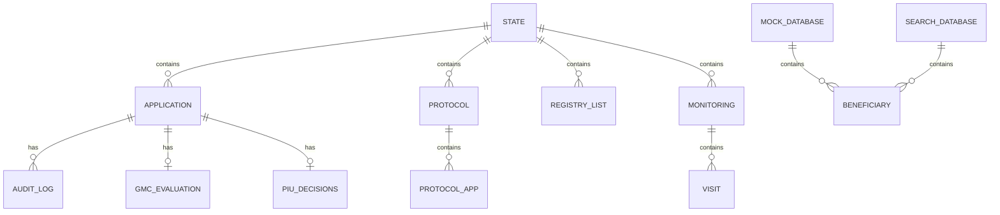
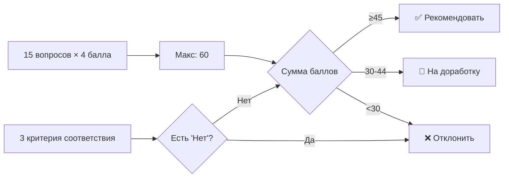
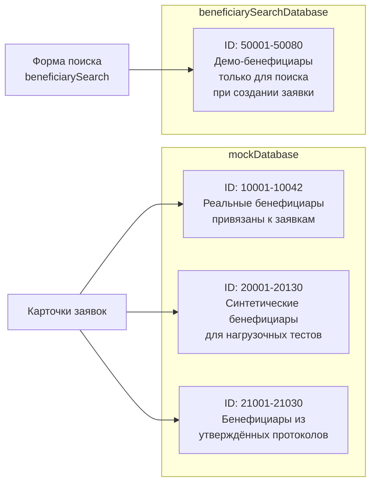

# Модель данных / Data Model

## Обзор

Все данные хранятся в объекте `window.state` и вспомогательных справочниках.



---

## window.state

Основной контейнер всех данных приложения.

```typescript
interface State {
  applications: Application[];    // Все заявки
  protocols: Protocol[];          // Утвержденные протоколы Комитета
  registryLists: RegistryList[];  // Входящие реестры для Комитета
  monitoring: {                   // Данные мониторинга
    [appId: string]: Visit[];     // Ключ — ID заявки
  };
}
```

---

## Application (Заявка)

```typescript
interface Application {
  // === Идентификация ===
  id: string;                    // "10001", "10002", ...
  beneficiaryId?: string;        // ID бенефициара (может = id)

  // === Данные заявителя ===
  name: string;                  // ФИО заявителя (sanitized)
  beneficiaryName?: string;      // ФИО из формы (sanitized)
  inn?: string;                  // ИНН (sanitized)
  contacts?: string;             // Контакты (sanitized)

  // === Данные заявки ===
  sector: string;                // Сектор (может содержать HTML: <span class="ru">)
  amount: string;                // Сумма ("15 000")
  date: string;                  // Дата последнего действия ("12.03.2026, 09:15")
  status: ApplicationStatus;     // Текущий статус

  // === Доработка ===
  revisionCount?: number;        // Счетчик доработок (0-3)
  reactivated?: boolean;         // Реактивирована после 3 мес. паузы

  // === Протокол Комитета ===
  protocolId?: string;           // ID протокола ("СП-9001")

  // === Оценки ===
  gmcEvaluation?: GmcEvaluation; // Результат скоринга ШИГ
  piuDecisions?: { [step: number]: string | null };  // Решения ГРП
  piuStatus?: { [step: number]: string };             // Статус шагов ГРП
  piuComment?: string;           // Комментарий ГРП при возврате

  // === Аудит ===
  auditLog: AuditLogEntry[];     // История действий
}
```

### ApplicationStatus (все возможные значения)

```typescript
type ApplicationStatus =
  | 'draft'                    // Черновик
  | 'gmc_review'              // На рассмотрении в ШИГ
  | 'fac_revision'            // На доработке у Фасилитатора
  | 'postponed'               // Отложена (3 мес.)
  | 'piu_review'              // На проверке в ГРП
  | 'gmc_revision'            // Возвращена из ГРП в ШИГ
  | 'gmc_preparation'         // Подготовка к реестру (ШИГ)
  | 'gmc_ready_for_registry'  // Готова для реестра
  | 'com_review'              // На решении Комитета
  | 'approved'                // Одобрена
  | 'rejected';               // Отклонена
```

---

## AuditLogEntry (Запись аудита)

```typescript
interface AuditLogEntry {
  date: string;       // "12.03.2026, 09:15"
  actor: string;      // "Фасилитатор", "ШИГ / КУГ", "ГРП / PIU", "Кумита / Комитет", "Система"
  action: string;     // Действие на таджикском (sanitized)
  actionRu: string;   // Действие на русском (sanitized)
  color: string;      // Tailwind цвет: "blue", "emerald", "amber", "red", "slate", "purple"
  icon: string;       // Lucide иконка: "send", "check", "alert-triangle", "x-circle", ...
  comment?: string;   // Комментарий (sanitized)
}
```

---

## GmcEvaluation (Скоринг ШИГ)

```typescript
interface GmcEvaluation {
  // Критерии соответствия (Да/Нет)
  el1?: 'yes' | 'no';   // Критерий 1
  el2?: 'yes' | 'no';   // Критерий 2
  el3?: 'yes' | 'no';   // Критерий 3

  // Скоринг по 15 критериям (1-4 балла каждый, макс. 60)
  q1?: string;   // "1" | "2" | "3" | "4"
  q2?: string;
  q3?: string;
  q4?: string;
  q5?: string;
  q6?: string;
  q7?: string;
  q8?: string;
  q9?: string;
  q10?: string;
  q11?: string;
  q12?: string;
  q13?: string;
  q14?: string;
  q15?: string;

  comment?: string;  // Комментарий эксперта
}
```

### Правила скоринга



---

## Protocol (Утвержденный протокол)

```typescript
interface Protocol {
  id: string;            // "СП-9001", "ПР-XXXX"
  date: string;          // "01.03.2026"
  exactTime: string;     // "10:03"
  okCount: number;       // Число одобренных
  rejCount: number;      // Число отклоненных
  totalAmount: number;   // Общая сумма одобренных
  apps: ProtocolApp[];   // Заявки в протоколе
}

interface ProtocolApp {
  id: string;            // ID заявки
  decision: 'ok' | 'rej'; // Решение Комитета
  comment?: string;      // Причина отклонения
}
```

---

## RegistryList (Входящий реестр для Комитета)

```typescript
interface RegistryList {
  id: string;                // "РЕЕСТР-GMS-1001"
  source: 'gms';             // Источник
  status: 'pending' | 'processed';  // Статус обработки
  date: string;              // Дата создания
  exactTime: string;         // Время
  apps: string[];            // ID заявок
  totalAmount: number;       // Общая сумма
  protocolId?: string;       // ID протокола (после обработки)
  processedAt?: string;      // Дата обработки
  virtual?: boolean;         // Автоматически сгенерирован
}
```

---

## Visit (Мониторинговый визит)

```typescript
interface Visit {
  id: number;             // 1, 2, 3, 4
  days: number;           // 30, 90, 180, 360
  status: 'active' | 'pending' | 'completed';
  plannedDate: string;    // "27.03.2026"
  daysLeft?: number;      // Дней до планового визита

  // Заполняются при завершении визита
  visitDate?: string;     // Фактическая дата визита
  equipment?: 'in_stock' | 'not_used' | 'sold';  // Состояние оборудования
  business?: 'active' | 'suspended' | 'closed';    // Состояние бизнеса
  income?: string | number;  // Месячный доход
  ecoCheck?: boolean;     // Экологические стандарты
  note?: string;          // Примечание
  photos?: number[];      // Заглушки для фото
}
```

---

## Beneficiary (Бенефициар / Справочник)

Хранится в `window.mockDatabase` и `window.beneficiarySearchDatabase`.

```typescript
interface Beneficiary {
  'full-name': string;    // "Саидова Мадина Алиевна"
  'birth-date': string;   // "12.03.1998"
  gender: string;         // "Зан" | "Мард"
  contacts: string;       // "+992 93 111 2233"
  address: string;        // "ш. Хуҷанд"
  inn: string;            // "9876543210"
  category: string;       // "Корҷӯй" | "Бекор" | "Муҳоҷир" | "Бевазан"
  education: string;      // "Олӣ" | "Миёнаи махсус" | "Миёна"
  course: string;         // "Дӯзандагӣ"
  certStatus: string;     // "certified" | "pending"
}
```

### Два справочника бенефициаров



---

## Связи между сущностями

```mermaid
graph TB
    APP[Application] -->|protocolId| PROT[Protocol]
    PROT -->|apps[].id| APP
    
    REGLIST[RegistryList] -->|apps[]| APP
    REGLIST -->|protocolId| PROT
    
    APP -->|id == key| MON[Monitoring visits]
    APP -->|id/beneficiaryId| BEN[Beneficiary<br/>mockDatabase]

    APP -->|auditLog[]| LOG[AuditLogEntry]
    APP -->|gmcEvaluation| EVAL[GmcEvaluation]
```
