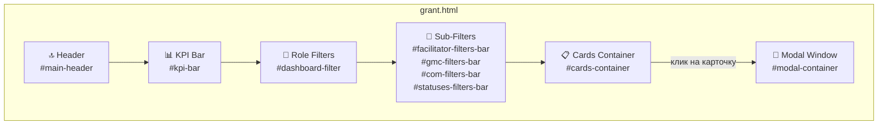
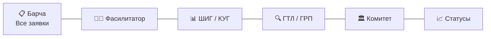
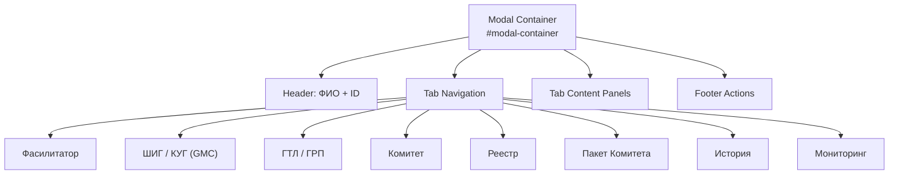
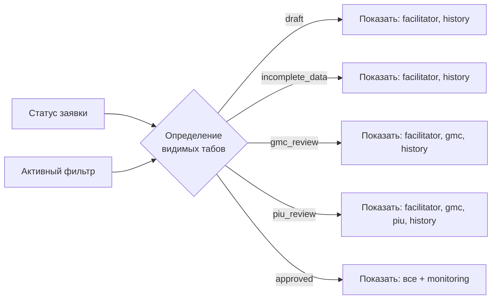
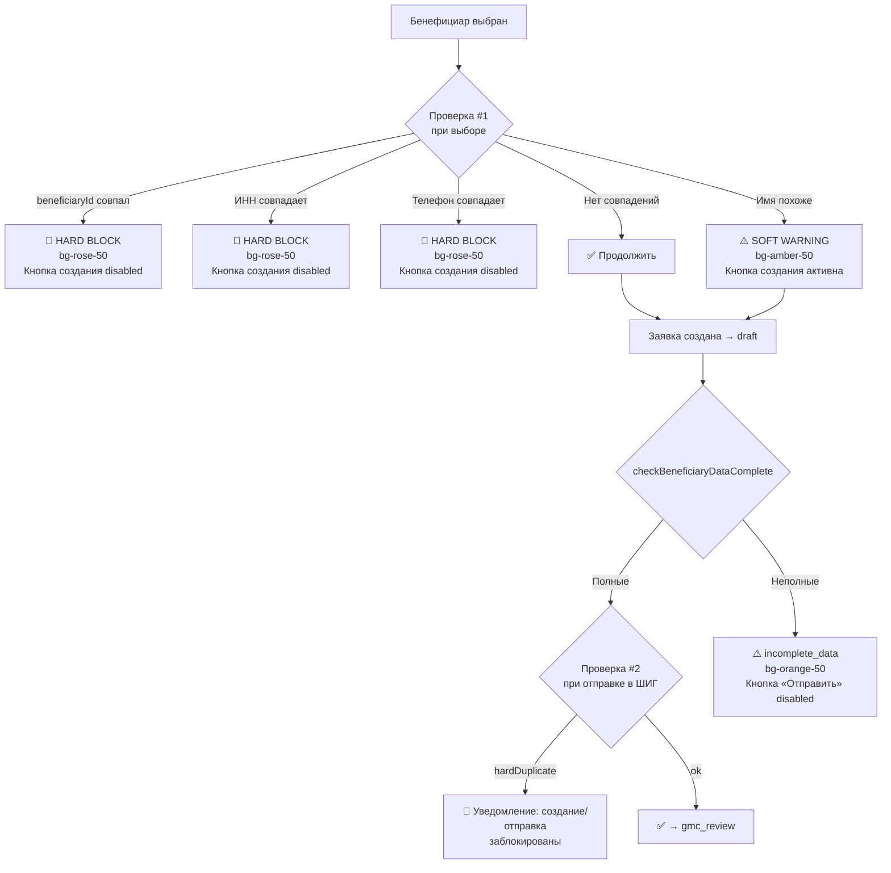
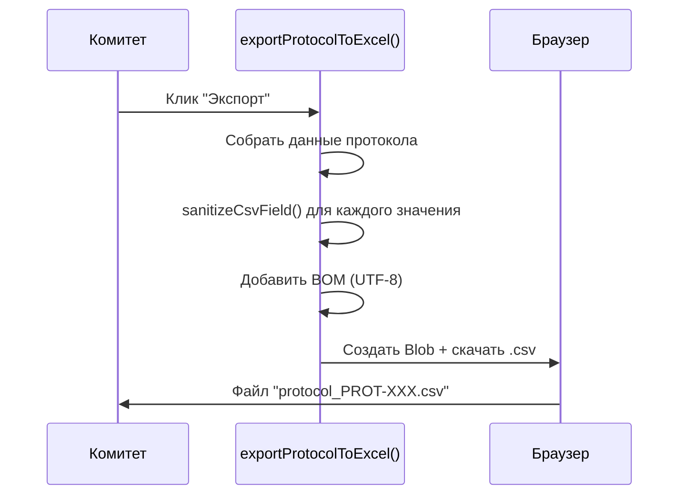

## Актуализация от 16.03.2026

- FAQ переводится на упрощенный сценарий навигации: в верхней панели оставлены базовые действия, вторичные инструменты убраны в `Дополнительно`.
- Для слабых пользователей ПК добавлен явный маршрут помощи: кнопка `Я не понимаю, что делать` с переходом к типовым ошибкам.
- Увеличены размеры интерактивных элементов FAQ (кнопки, summary, фильтры) и базовая читаемость текста.
- Введен порядок разделов beginner-first: `Общие` → `Типовые ошибки` → `Роли`, одинаково в контенте и в обоих оглавлениях (desktop/mobile).
- Для снижения когнитивной нагрузки ответы в FAQ приведены к однотипной структуре: `Что делать`, `Где нажать`, `Результат` во всех ключевых разделах.
- Проведена глубокая сверка FAQ с `ACCESS-CONTROL`, `WORKFLOW` и текущей логикой JS-модулей; в тексты добавлены точные сценарии ограничений доступа и разблокировки.

# UI-гид / UI Guide

## Актуализация от 14.03.2026

- В форме договора (блок `Договор с грантополучателем`) добавлена нижняя кнопка `Бекор кардан / Отмена` рядом с кнопками сохранения/предпросмотра/печати/PDF.
- Пользовательские предупреждения и подтверждения переведены на `AppNotify` (toast + confirm), прямые `alert(...)` оставлены только как fallback.
- В предупреждении о неполных данных бенефициара выводятся локализованные названия отсутствующих полей (TJ/RU), без английских ключей.

## Общая структура страницы



---

## Компоненты верхнего уровня

### Header (`#main-header`)

| Элемент | ID | Описание |
|---------|-----|----------|
| Логотип | — | SVG иконка award + заголовок "EIP" |
| KPI-индикатор | `#kpi-flip-box` | Виджет-счётчик активных грантов |
| Переключатель вида | `#viewModeToggle` | Grid ↔ List переключение |
| Индикатор роли | `#activeModeIndicator` | Строка: «Режим: Название роли» |

### KPI Bar (`#kpi-bar`)

```
┌────────────┬────────────┬────────────┬────────────┬────────────┐
│  Всего     │  На рассм. │ Одобрено   │ Отклонено  │ В работе   │
│  #kpi-total│  #kpi-rev  │ #kpi-apr   │ #kpi-rej   │ #kpi-proc  │
└────────────┴────────────┴────────────┴────────────┴────────────┘
```

Каждый KPI-блок обновляется через `updateAllBadges()` при каждом изменении состояния.

---

## Система фильтрации

### Главные фильтры (`#dashboard-filter`)

Верхняя панель с 6 кнопками ролей/статусов:



| data-filter | Показывает | Подфильтры |
|-------------|-----------|------------|
| `all` | Все заявки | Нет |
| `facilitator` | draft, fac_revision, postponed, incomplete_data | draft / incomplete_data / fac_revision / postponed |
| `gmc` | gmc_review, gmc_revision, gmc_preparation, gmc_ready_for_registry | review / revision / preparation / ready |
| `piu` | piu_review | Нет (только 1 статус) |
| `committee` | com_review + протоколы + реестры | incoming / protocols |
| `statuses` | все статусы | all / draft / revision / review / approved / postponed / rejected |

### Фильтр «Одобренные» (`approved_registry`)

В режиме одобренных используются поля:
- `#filter-sector`
- `#filter-region`
- `#filter-gender`
- `#filter-search-issued`

Режим поиска работает в двух сценариях:
- По ID/ФИО заявителя: показываются карточки отдельных заявителей (`approved_item`).
- По номеру списка/протокола: показываются карточки списков (`approved_list`).

Если поисковая строка пустая, по умолчанию отображаются карточки списков одобрений.

### Подфильтры

#### Фасилитатор (`#facilitator-filters-bar`)
```
[Черновики] [Неполные данные] [На доработке] [Отложенные]
```

#### ШИГ / КУГ (`#gmc-filters-bar`)
```
[На рассмотрении] [На исправлении] [Подготовка реестра] [К реестру]
```

#### Комитет (`#com-filters-bar`)
```
[Входящие реестры] [Утверждённые протоколы]
```

#### Статусы (`#statuses-filters-bar`)
```
[Все] [Черновики] [На доработке] [На рассмотрении] [Одобренные] [Отложенные] [Отклонённые]
```

---

## Карточки заявок

### Карточки в разделе «Одобренные»

В `approved_registry` рендерятся два типа карточек:
- `approved_list`: карточка списка/протокола с агрегированной статистикой.
- `approved_item`: карточка конкретного одобренного заявителя.

Открытие:
- `approved_list` открывает список через `openCommitteeBatch(protocolId)`.
- `approved_item` открывает карточку заявителя через `openApprovedFor(appId)`.

### Режим Grid (карточки)

Каждая карточка (`card-{id}`) выводится в виде блока и содержит:

```
┌─────────────────────────────────────┐
│ Имя Фамилия      [Статус-бейдж]    │
│ #10001 • Сектор  [Протокол] [1/3]  │
│                                     │
│ 25 000 сомонӣ / сом.                │
│                                     │
│ 15.03.2025   [Кнопка / Действие]   │
└─────────────────────────────────────┘
```

#### Бейджи на карточке

- **Статус-бейдж**: двуязычный (напр. «Барои омодасозӣ / На подготовке»)
- **Протокол-бейдж**: `СП-9001` (если заявка в протоколе) — зелёный, teal
- **Доработка-бейдж**: компактный инлайн `<span>` с иконкой `refresh-cw`.
Для `fac_revision` показывает фактический счетчик (`1/3`, `2/3`).
Для `postponed` всегда отображается `3/3`.
- **Индикатор версии документа**: `Current Word Version: Vn` в карточках и строках таблиц.
- **Индикатор договора** (для `approved`): бейдж `Договор` / `Без договора`.

### Режим List (таблица)

Отображение строкой с колонками:

```
┌─────┬──────────────┬─────────┬──────────┬──────────┬──────────────┐
│  ID │    ФИО       │   ИНН   │   Район  │  Статус  │   Действие   │
├─────┼──────────────┼─────────┼──────────┼──────────┼──────────────┤
│10001│ Каримов А.   │12345678 │ Бохтар   │ Draft    │ [Открыть]    │
└─────┴──────────────┴─────────┴──────────┴──────────┴──────────────┘
```

Переключение `setViewMode('grid' | 'list')` через кнопку `#viewModeToggle`.

---

## Модальное окно

### Структура (`#modal-container`)



### Табы и видимость

| Таб | data-tab | Содержание | Интерактивность |
|-----|----------|-----------|-----------------|
| Фасилитатор | `facilitator` | Форма бенефициара: ИНН, имя, район, пол, сектор, инвалидность, сумма | ✏️ Заполняет Фасилитатор |
| ШИГ / КУГ | `gmc` | 15 критериев скоринга (1–4 балла каждый), 3 критерия соответствия (yes/no), комментарий, решение | ✏️ Заполняет ШИГ / КУГ |
| ГТЛ / ГРП | `piu` | Чек-лист верификации (1 шаг), комментарий | ✏️ Заполняет ГТЛ / ГРП |
| Комитет | `committee` | Решение по каждой заявке в пакете | ✏️ Заполняет Комитет |
| Реестр | `registry` | Превью реестра перед отправкой в Комитет | 👁 Только просмотр |
| Пакет | `batch` | Пакет заявок на рассмотрение Комитета | ✏️ Комитет |
| История | `history` | Лог изменений, datetime + action + actor | 👁 Просмотр |
| Мониторинг | `monitoring` | 4 визита ׸ пост-выдачных проверок | ✏️ Фасилитатор |

### Блок подписанного договора (в `pane-approved`)

- В блоке финальных документов для `approved` заявки доступна карточка `Подписанный договор`.
- Для Фасилитатора активны действия: выбрать файл, загрузить, скачать.
- Для остальных ролей блок доступен только для просмотра и скачивания (если файл уже загружен).
- В карточке показываются метаданные: имя файла, дата/время загрузки, кто загрузил.
- После загрузки скачивание отдает исходный загруженный файл.

Ограничения загрузки:
- Разрешены только `PDF/JPG/JPEG/PNG`.
- Максимальный размер: `10MB`.
- Загрузка доступна только при статусе `approved`.

Поведение открытия карточек вне зоны роли:
- Для `approved` и `rejected` карточка открывается в режиме read-only (история/документы).
- Для остальных чужих статусов открытие блокируется с предупреждением.

### Full-width форма создания договора (в `pane-approved`)

После блока финальных документов расположен отдельный full-width раздел `Договор с грантополучателем / Создание договора`.

Поведение:
- В свернутом виде показывается кнопка `Создать договор`.
- После нажатия раскрывается аккордеон (`grant-contract-form-shell`) с формой заполнения.
- Для ролей, отличных от Фасилитатора, и для статусов, отличных от `approved`, раздел только для просмотра (кнопка неактивна).
- Если черновик уже сохранен, текст кнопки меняется на `Редактировать договор`.

Структура формы:
- Секция `Реквизиты гранта`.
- Секция `Стороны`.
- Секция `Контакты`.
- Секция `Банковские данные`.
- Секция `Подписи`.

Правила полей:
- Порядок полей фиксирован и соответствует структуре шаблона договора.
- Номер договора: шаблон `Ш-******-ДДММГГ`.
- Поле суммы гранта авто-заполняется из заявки и недоступно для ручного редактирования.
- Кнопки действий: `Сохранить черновик`, `Сбросить автополя`, `Предпросмотр`, `Печать`, `Экспорт PDF`, `Бекор кардан / Отмена`.

### Управление табами (`setAvailableTabs`)

Система автоматически скрывает/показывает табы по статусу заявки и активному фильтру:



---

## Вкладка Фасилитатора — детали формы

### Режим «На доработке от ШИГ» (`fac_revision`)

В режиме доработки форма ведет себя иначе, чтобы пользователь не перезагружал лишние файлы:

- Показывается отдельная визуальная подсказка в блоке обязательных документов.
- PDF и фото-поля отключены (фиксированные вложения базовой версии).
- Требуется только загрузка новой Word-версии.
- Поля `Сектор` и `Сумма` заблокированы для редактирования и отображаются как ранее выбранные.

### Поиск бенефициара

```
┌──────────────────────────────────────┐
│  🔍 Поиск бенефициара (ИНН / имя)   │
│  ┌──────────────────────────────────┐│
│  │ [ поле ввода min 3 символа ]     ││
│  └──────────────────────────────────┘│
│                                      │
│  Результаты поиска:                  │
│  ┌──────────────────────────────────┐│
│  │ ✅ Каримов Алишер (1234567890)  ││
│  │    Сертификат: CERT-001          ││
│  │    [Выбрать]                     ││
│  └──────────────────────────────────┘│
└──────────────────────────────────────┘
```

### Проверка дубликатов при создании

Дубликаты проверяются в **двух точках**: при выборе бенефициара и при нажатии «Отправить в ШИГ».



> Функция `updateQueryDuplicateWarning()` также проверяет дубликаты **в реальном времени при каждом вводе** в поле поиска (до выбора бенефициара).

### Блок неполных данных бенефициара

При открытии заявки во вкладке Фасилитатора вызывается `applyCompletenessCheck(source)`, которая проверяет 9 обязательных полей бенефициара в базе данных.

```
┌──────────────────────────────────────────┐
│ ⚠️  Маълумоти бенефициар нопурра аст!   │
│     Данные бенефициара неполные!         │
│                                          │
│  Нопурра / Отсутствует:                  │
│  ┌────────────┐ ┌──────────┐ ┌────────┐  │
│  │ ИНН        │ │ Адрес    │ │ Ташкил │  │
│  └────────────┘ └──────────┘ └────────┘  │
│                                          │
│  Стиль: bg-orange-50 border-orange-300   │
│  Бейджи: bg-orange-200 text-orange-800   │
└──────────────────────────────────────────┘
```

**Поведение:**
- В `fillFacilitatorForm()`: вызывается `applyCompletenessCheck(source)` → если `isComplete === false`:
  - Кнопка `#btn-submit-facilitator` (Отправить в ШИГ) → `disabled`, `opacity-50`, `pointer-events-none`
  - Кнопка «Сохранить черновик» остаётся активной
- Поля с отсутствующими данными подсвечиваются: `ring-2 ring-red-300 bg-red-50`, текст → `❌ Маълумот нест`
- В `saveToDraft()`: если данные неполные → `app.status = 'incomplete_data'`, `app.missingFields = [...]`
- В `submitToGmc()`: двойная защита — если `isComplete === false` → warning/error toast + `return`.
- При повторном открытии (`fillFacilitatorForm`) проверка выполняется заново из базы

---

## Вкладка ШИГ / КУГ — скоринг

### Критерии оценки (15 штук, 0–4 балла)

```
┌──────────────────────────────────────┐
│  Критерий 1 (dropdown: 0 1 2 3 4)   │
│  Критерий 2 (dropdown: 0 1 2 3 4)   │
│  ...                                 │
│  Критерий 15 (dropdown: 0 1 2 3 4)  │
│                                      │
│  ═══════════════════════════════════ │
│  Итого: 48 / 60                      │
│                                      │
│  Соответствие 1: (✅ / ❌)           │
│  Соответствие 2: (✅ / ❌)           │
│  Соответствие 3: (✅ / ❌)           │
│                                      │
│  Комментарий: [текстовое поле]       │
│                                      │
│  [Рекомендовать] [На доработку] [Отклонить] │
└──────────────────────────────────────┘
```

### Автоматика кнопок

| Балл | el (eligibility) | Кнопки доступны |
|------|------------------|-----------------|
| ≥ 45 | all "yes" | ✅ Рекомендовать, На доработку |
| 30–44 | all "yes" | На доработку |
| < 30 | — | Только Отклонить |
| any | any "no" | Только Отклонить |

---

## Вкладка Мониторинга

### 4 постгрантовых визита

```
┌──────────────────────────────┐
│ Визит 1 (+30 дней)           │
│ Статус: ✅ completed         │
│ Визит 2 (+90 дней)           │
│ Статус: 🔵 active            │
│  ┌──────────────────────┐    │
│  │ Оборудование: [...]  │    │
│  │ Затраты: [...]       │    │
│  │ Сотрудники: [...]    │    │
│  │ Обучение: [...]      │    │
│  │ [Сохранить визит]    │    │
│  └──────────────────────┘    │
│ Визит 3 (+180 дней)          │
│ Статус: 🔴 pending           │
│ Визит 4 (+360 дней)          │
│ Статус: 🔴 pending           │
└──────────────────────────────┘
```

### Обязательные поля визита

Для сохранения визита **все 4 поля обязательны**:

| Поле | ID | Описание |
|------|----|----------|
| Оборудование | `mon-equipment-{visitIdx}` | Состояние: в наличии / не используется / продано |
| Бизнес | `mon-business-{visitIdx}` | Статус: активен / приостановлен / закрыт |
| Доход | `mon-income-{visitIdx}` | Средний месячный доход |
| Экология | `mon-eco-{visitIdx}` | Экологические стандарты: да / нет |

Если хотя бы одно не заполнено → warning toast: `'Лутфан ҳамаи майдонҳои ҳатмиро пур кунед!'`

### Алерт: оборудование продано

Если `equipment = "sold"` → `checkAlert()` формирует:
1. **Inline-предупреждение** (красный блок): `'Огоҳӣ ба Админ фиристода мешавад!'`
2. **Toast**: `'Огоҳинома ба Администратор фиристода шуд!'`

---

## Цветовая система статусов

| Статус | Цвет | Tailwind-класс |
|--------|------|---------------|
| draft | Серый | `bg-gray-100 text-gray-800` |
| incomplete_data | Оранжевый | `bg-orange-100 text-orange-800` |
| fac_revision | Жёлтый | `bg-yellow-100 text-yellow-800` |
| gmc_review | Синий | `bg-blue-100 text-blue-800` |
| gmc_revision | Оранжевый | `bg-orange-100 text-orange-800` |
| gmc_preparation | Индиго | `bg-indigo-100 text-indigo-800` |
| gmc_ready_for_registry | Фиолетовый | `bg-purple-100 text-purple-800` |
| piu_review | Бирюзовый | `bg-teal-100 text-teal-800` |
| com_review | Розовый | `bg-pink-100 text-pink-800` |
| approved | Зелёный | `bg-green-100 text-green-800` |
| rejected | Красный | `bg-red-100 text-red-800` |
| postponed (срок не истек) | Серый | `bg-gray-200 text-gray-600` |
| postponed (unlock-ready: готова к разблокировке) | Зеленый | `bg-emerald-100 text-emerald-800` |

---

## Лента уведомлений разблокировки

- В шапке доступна кнопка-колокольчик с бейджем количества необработанных уведомлений.
- В ленту попадают заявки `postponed`, у которых истек срок блокировки и отсутствует `unlockNoticeProcessedAtISO`.
- Действия в ленте:
`Обработано` — помечает уведомление как обработанное.
`Разблокировать` — запускает ручную разблокировку Фасилитатором.

---

## Двуязычность (Tajik / Russian)

### Принцип

**Все** UI-надписи в системе являются двуязычными: таджикский текст отображается крупнее (основной), русский — мельче и с пониженной непрозрачностью (вторичный). Ни одна надпись в интерфейсе не существует на одном языке.

### Форматы

```html
<!-- Инлайн (кнопки, лейблы, бейджи) -->
Тасдиқшуда <span class="ru">/ Сертифицирован</span>
Тасдиқшуда <span class="ru font-normal">/ Сертифицирован</span>

<!-- Блочный (заголовки, описания) -->
<span>Фасилитатор</span><span class="ru-block">Фасилитатор</span>
```

### CSS-классы

| Класс | Стиль | Использование |
|-------|-------|---------------|
| `.ru` | `opacity: 0.5`, `font-size: 0.75em` | Инлайн-перевод через `/ Текст` |
| `.ru-block` | `opacity: 0.5`, `display: block`, `font-size: 0.75em` | Блочный перевод под основным текстом |
| `.ru.font-normal` | То же + `font-weight: normal` | Внутри `<b>` тегов, чтобы русский не был жирным |

### Зоны покрытия

Двуязычность охватывает ВСЕ элементы интерфейса:

- **Кнопки действий**: Баҳогузорӣ / Оценить, Кушодан / Открыть, и т.д.
- **Бейджи статусов**: Барои омодасозӣ / На подготовке, Тасдиқшуда / Утв., и т.д.
- **Поля формы**: Рақами ID довталаб / ID заявителя, ННШ-и довталаб / ФИО заявителя
- **Критерии оценки**: все 18 вопросов + 3 критерия допуска
- **Метки баллов**: Хол / Балл 1-4, хол/балл ≥ 45
- **Оповещения (AppNotify)**: toast/confirm для пользовательских сценариев (с fallback alert только в helper)
- **Плейсхолдеры**: Матнро ворид кунед... / Введите текст...
- **Документы**: Нақшаи тиҷоратӣ / Бизнес-план, Шартномаи имзошуда / Подписанный договор
- **Документные действия**: Боргирии Word / Скачать Word, Боргирии PDF / Скачать PDF, Боргирии фото / Скачать фото
- **Валюта**: сомонӣ / сом.
- **Пустые состояния**: Дархостҳо ёфт нашуданд / Заявки не найдены
- **Заголовки панелей**: Мониторинги пасгрантӣ / Пост-грантовый мониторинг
- **Заголовки визитов мониторинга**: Боздиди / Визит X (+Y рӯз / дн.)
- **Предупреждения дубликатов**: Манъ / Блокировка, Такрор ёфт шуд / Найден дубль
- **CSV-экспорт**: все заголовки столбцов двуязычные

---

## Пустое состояние (Empty State)

Когда карточек по фильтру нет, отображается `#empty-state`:

```
┌─────────────────────────────────┐
│                                 │
│      📋  (Lucide: inbox)        │
│                                 │
│  Дархостҳо ёфт нашуданд        │
│  / Заявки не найдены            │
│                                 │
│  Дархостҳо мувофиқи филтрҳо    │
│  ёфт нашуданд                   │
│  / По выбранным фильтрам        │
│  не найдено                     │
│                                 │
└─────────────────────────────────┘
```

---

## Адаптивность (Responsive)

| Размер | Поведение |
|--------|-----------|
| `≥ 1024px` | Grid 3 колонки, полные табы |
| `768px–1024px` | Grid 2 колонки |
| `< 768px` | Grid 1 колонка, модалка на всю ширину |

Tailwind-классы: `grid-cols-1 md:grid-cols-2 lg:grid-cols-3`.

---

## Экспорт данных

### Протокол в Excel (CSV)



### Пакет документов бизнес-плана (скачивание)

В интерфейсе доступны 3 отдельные кнопки скачивания:
- Word (текущая версия `Vn`)
- PDF (фиксированное вложение)
- Фото-комплект (фиксированное вложение)

Источники:
- Word: `downloadBusinessPlanFile()`
- PDF: `downloadBusinessPlanPdfFile()`
- Фото: `downloadBusinessPlanPhotoPack()`

Word-файл скачивается как текстовая выгрузка пакета с историей версий:

```
BUSINESS PLAN PACKAGE / ПАКЕТ БИЗНЕС-ПЛАНА
ID: 10040
Текущая версия Word: V2 (plan_v2.docx)
PDF (фиксированный): plan_fixed.pdf
Фото (фиксированные): photo_1.jpg, photo_2.jpg, photo_3.jpg, photo_4.jpg
```
