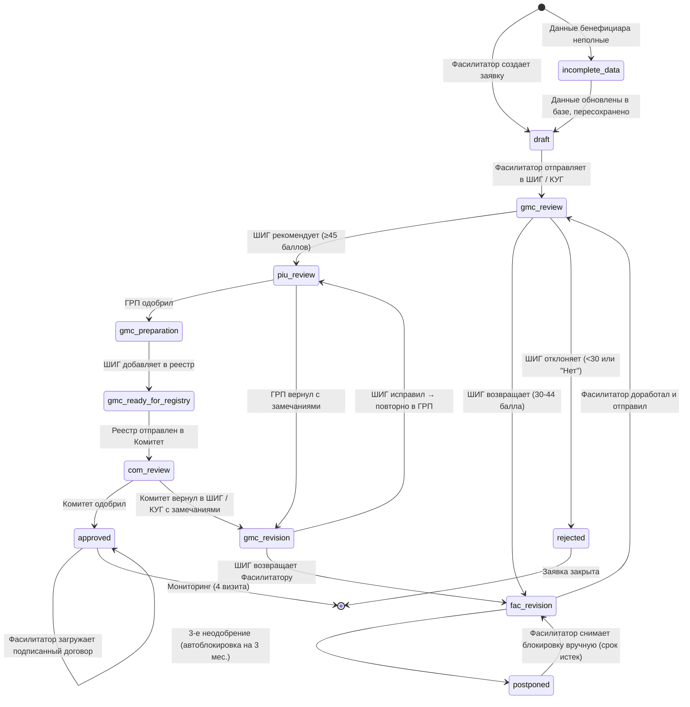
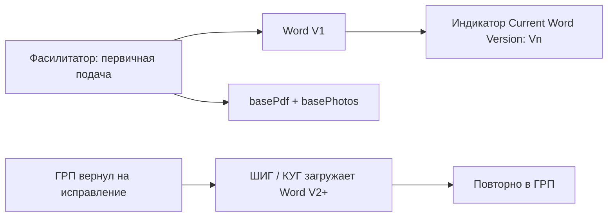

# Жизненный цикл заявки / Application Workflow

## Актуализация от 14.03.2026

- Пользовательские сообщения в процессах переведены на `AppNotify` (toast/confirm); прямой `alert` используется только как fallback.
- Для `incomplete_data` в UI показываются локализованные наименования отсутствующих полей (TJ/RU), без отображения технических ключей.
- В блоке черновика договора (`approved`) добавлена нижняя кнопка `Бекор кардан / Отмена`.

## Все статусы заявки

| Статус | Код | Роль-владелец | Описание |
|--------|-----|---------------|----------|
| Черновик | `draft` | Фасилитатор | Заявка создана, не отправлена |
| Неполные данные | `incomplete_data` | Фасилитатор | Данные бенефициара неполные в базе |
| На рассмотрении в ШИГ / КУГ | `gmc_review` | ШИГ / КУГ | Первичная оценка и скоринг |
| На доработке | `fac_revision` | Фасилитатор | Возвращена для исправлений |
| Отложена | `postponed` | Фасилитатор | 3-е неодобрение: заявка блокируется на 3 месяца, затем получает признак готовности к разблокировке (unlock-ready) |
| Проверка ГТЛ / ГРП | `piu_review` | ГТЛ / ГРП | Социально-экологическая экспертиза |
| Возврат на доработку | `gmc_revision` | ШИГ / КУГ | Возврат из ГТЛ / ГРП или Комитета с замечаниями |
| Подготовка к реестру | `gmc_preparation` | ШИГ / КУГ | ГРП одобрил, ШИГ / КУГ готовит к отправке |
| Готова для реестра | `gmc_ready_for_registry` | ШИГ / КУГ | Включена в реестр для Комитета |
| На решении Комитета | `com_review` | Комитет | В составе реестра на утверждении |
| Одобрена | `approved` | Фасилитатор (пост-одобрение) | Грант выдан, доступны: мониторинг, формирование черновика договора и загрузка подписанного договора |
| Отклонена | `rejected` | — | Заявка отклонена (ШИГ или Комитетом) |

---

## Диаграмма переходов статусов (State Machine)



---

## Матрица переходов

| Из статуса ↓ | В статус → | Инициатор | Условие |
|---|---|---|---|
| `—` | `draft` | Фасилитатор | Создание заявки (данные полные) |
| `—` | `incomplete_data` | Система | Данные бенефициара неполные при сохранении |
| `incomplete_data` | `draft` | Фасилитатор | Данные обновлены в базе, пересохранено |
| `draft` | `gmc_review` | Фасилитатор | Заполнены сектор + сумма, нет дублей |
| `gmc_review` | `piu_review` | ШИГ | Балл ≥ 45, все el = "yes" |
| `gmc_review` | `fac_revision` | ШИГ | Балл 30-44, revisionCount < 3 |
| `gmc_review` | `rejected` | ШИГ | Балл < 30 или el = "no" |
| `fac_revision` | `gmc_review` | Фасилитатор | Доработка завершена |
| `fac_revision` | `postponed` | Система | revisionCount достиг 3 (3-е неодобрение) |
| `postponed` | `fac_revision` | Фасилитатор | Срок блокировки истек и выполнено ручное снятие блокировки |
| `piu_review` | `gmc_preparation` | ГРП | Все проверки пройдены |
| `piu_review` | `gmc_revision` | ГРП | Есть замечания |
| `gmc_revision` | `piu_review` | ШИГ | ШИГ исправил, повторно в ГРП |
| `gmc_revision` | `fac_revision` | ШИГ | ШИГ возвращает Фасилитатору |
| `gmc_preparation` | `gmc_ready_for_registry` | ШИГ / КУГ | Нажал "Добавить в реестр" |
| `gmc_ready_for_registry` | `com_review` | ШИГ / КУГ | Реестр отправлен в Комитет |
| `com_review` | `approved` | Комитет | Решение "Одобрить" |
| `com_review` | `gmc_revision` | Комитет | Решение "Отклонить" + обязательный комментарий |
| `approved` | `approved` | Фасилитатор | Сохранение/обновление черновика договора (без смены статуса) |
| `approved` | `approved` | Фасилитатор | Загрузка/обновление подписанного договора (без смены статуса) |

---

## Визуальное отображение статусов

| Статус | Цвет карточки | Цвет бейджа | Текст бейджа (Tajik / Russian) |
|--------|--------------|-------------|-------------------------------|
| `draft` | белый | серый | Сиёҳнавис / Черновик |
| `incomplete_data` | оранжевый | оранжевый | Нопурра / Неполные |
| `gmc_review` | голубой | синий | Ба ШИГ пешниҳод шуд / В КУГ |
| `fac_revision` | красный | красный | Амали Фасилитатор / Действие Фас. |
| `postponed` | серый | серый | Мавқуф / Отложено (3 мес.) |
| `piu_review` | индиго | индиго | Барои баррасӣ ба ГТЛ / В ГРП |
| `gmc_revision` | янтарный/розовый | янтарный/розовый | Аз ГТЛ баргашт ё аз Кумита / Возврат из ГРП или Комитета |
| `gmc_preparation` | голубой | синий | Барои омодасозӣ / На подготовке |
| `gmc_ready_for_registry` | индиго | индиго | Дар реестр / В реестре |
| `com_review` | бирюзовый | бирюзовый | Қарори Кумита / Решение Комитета |
| `approved` | зеленый | зеленый | Тасдиқ шуд / Одобрена |
| `rejected` | красный | красный | Рад карда шуд / Отклонена |

---

## Правила лимитов и разблокировки

```mermaid
flowchart TD
    A[Возврат на доработку] --> B{revisionCount?}
    B -->|1/3| C[fac_revision<br/>Фасилитатор дорабатывает]
    B -->|2/3| C
    B -->|3/3| D[postponed<br/>Автоблокировка на 3 мес.]
    D --> E{3 месяца прошло?}
    E -->|Нет| F[Заявка заморожена]
    E -->|Да| G[Ожидает действия<br/>Фасилитатора (unlock-ready)]
    G --> H[fac_revision<br/>Ручная разблокировка<br/>reactivated: true<br/>revisionCount: 0]
    H --> I[Заявка снова доступна<br/>Фасилитатору]
    C --> J[Фасилитатор отправляет<br/>gmc_review]
    J --> K{ШИГ оценивает}
```

---

## Документный workflow (Word/PDF/Фото)

| Элемент | Правило |
|---|---|
| Word бизнес-план | Версионируется (`V1`, `V2`, `V3`...) |
| PDF бизнес-план | Фиксируется как базовое вложение, не версионируется |
| Фото-комплект | Фиксируется как базовое вложение, не версионируется |
| Первичная отправка | Обязательно: Word + PDF + ровно 4 фото |
| Возврат из ГРП в ШИГ / КУГ | Требует новой Word-версии |
| UI-индикатор | В карточках/таблицах: `Current Word Version: Vn` |



---

## Подписанный договор (после approved)

| Элемент | Правило |
|---|---|
| Когда доступно | Только для заявок в `approved` |
| Кто загружает | Фасилитатор |
| Типы файлов | PDF/JPG/JPEG/PNG (до 10MB) |
| Что видно в UI | Файл, дата/время загрузки, кто загрузил, кнопка скачивания |
| Аудит | Каждая загрузка/обновление записывается в `auditLog` |
| Скачивание | Возвращается исходный загруженный файл (если доступен в состоянии) |

Примечание по доступу:
- Статусы `approved` и `rejected` доступны для открытия в режиме только просмотра из любого ролевого фильтра.

## Черновик договора (после approved)

| Элемент | Правило |
|---|---|
| Где доступно | `pane-approved`, full-width collapsible блок внизу истории |
| Кто редактирует | Только Фасилитатор |
| Когда | Только при статусе `approved` |
| Формат номера | `Ш-******-ДДММГГ` |
| Автополя | Данные заявки и базы (ID, протокол, дата, проект, сумма, контакты из профиля) |
| Валидация | Мягкая при сохранении черновика, строгая перед предпросмотром/печатью/PDF |
| Статус | Не меняет `ApplicationStatus` (остается `approved`) |
