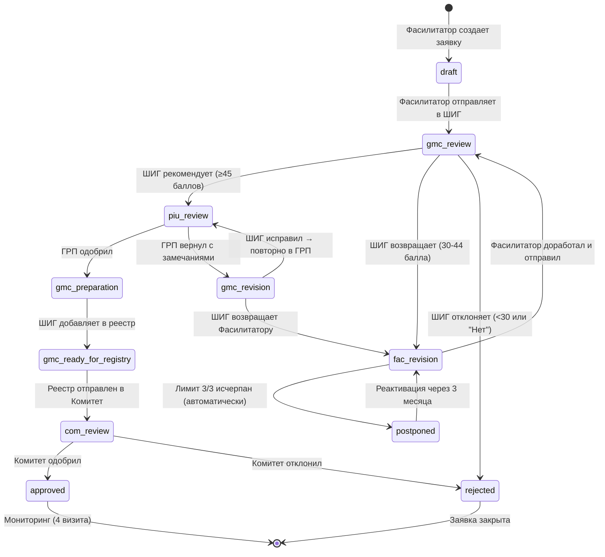
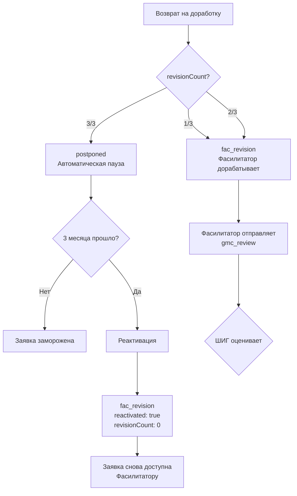

# Жизненный цикл заявки / Application Workflow

## Все статусы заявки

| Статус | Код | Роль-владелец | Описание |
|--------|-----|---------------|----------|
| Черновик | `draft` | Фасилитатор | Заявка создана, не отправлена |
| На рассмотрении в ШИГ | `gmc_review` | ШИГ/КУГ | Первичная оценка и скоринг |
| На доработке | `fac_revision` | Фасилитатор | Возвращена для исправлений |
| Отложена | `postponed` | Система | Исчерпан лимит доработок (3/3), пауза 3 мес. |
| Проверка ГРП | `piu_review` | ГРП/PIU | Социально-экологическая экспертиза |
| Возврат из ГРП | `gmc_revision` | ШИГ/КУГ | ГРП вернул с замечаниями |
| Подготовка к реестру | `gmc_preparation` | ШИГ/КУГ | ГРП одобрил, ШИГ готовит к отправке |
| Готова для реестра | `gmc_ready_for_registry` | ШИГ/КУГ | Включена в реестр для Комитета |
| На решении Комитета | `com_review` | Комитет | В составе реестра на утверждении |
| Одобрена | `approved` | — | Грант выдан, запущен мониторинг |
| Отклонена | `rejected` | — | Заявка отклонена (ШИГ или Комитетом) |

---

## Диаграмма переходов статусов (State Machine)

---

## Матрица переходов

| Из статуса ↓ | В статус → | Инициатор | Условие |
|---|---|---|---|
| `—` | `draft` | Фасилитатор | Создание заявки |
| `draft` | `gmc_review` | Фасилитатор | Заполнены сектор + сумма, нет дублей |
| `gmc_review` | `piu_review` | ШИГ | Балл ≥ 45, все el = "yes" |
| `gmc_review` | `fac_revision` | ШИГ | Балл 30-44, revisionCount < 3 |
| `gmc_review` | `rejected` | ШИГ | Балл < 30 или el = "no" |
| `fac_revision` | `gmc_review` | Фасилитатор | Доработка завершена |
| `fac_revision` | `postponed` | Система | revisionCount достиг 3 |
| `postponed` | `fac_revision` | Система | Прошло 3 месяца, reactivated = true |
| `piu_review` | `gmc_preparation` | ГРП | Все проверки пройдены |
| `piu_review` | `gmc_revision` | ГРП | Есть замечания |
| `gmc_revision` | `piu_review` | ШИГ | ШИГ исправил, повторно в ГРП |
| `gmc_revision` | `fac_revision` | ШИГ | ШИГ возвращает Фасилитатору |
| `gmc_preparation` | `gmc_ready_for_registry` | ШИГ | Нажал "Добавить в реестр" |
| `gmc_ready_for_registry` | `com_review` | ШИГ | Реестр отправлен в Комитет |
| `com_review` | `approved` | Комитет | Решение "Одобрить" |
| `com_review` | `rejected` | Комитет | Решение "Отклонить" |

---

## Визуальное отображение статусов

| Статус | Цвет карточки | Цвет бейджа | Текст бейджа |
|--------|--------------|-------------|-------------|
| `draft` | белый | серый | Сиёҳнавис |
| `gmc_review` | голубой | синий | Ба ШИГ пешниҳод шуд |
| `fac_revision` | красный | красный | Амали Фасилитатор |
| `postponed` | серый | серый | Мавқуф (3 моҳ) |
| `piu_review` | индиго | индиго | Барои баррасӣ ба ГРП |
| `gmc_revision` | янтарный | янтарный | Аз ГРП баргашт |
| `gmc_preparation` | голубой | синий | Барои омодасозӣ |
| `gmc_ready_for_registry` | индиго | индиго | Дар реестр |
| `com_review` | бирюзовый | бирюзовый | Қарори Кумита |
| `approved` | зеленый | зеленый | Тасдиқ шуд |
| `rejected` | красный | красный | Рад карда шуд |

---

## Правила лимитов и реактивации

